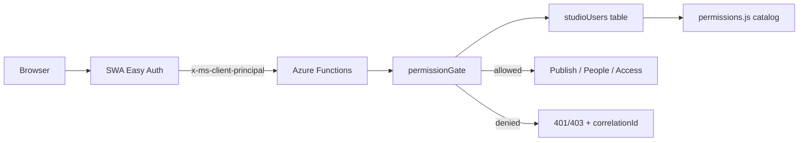
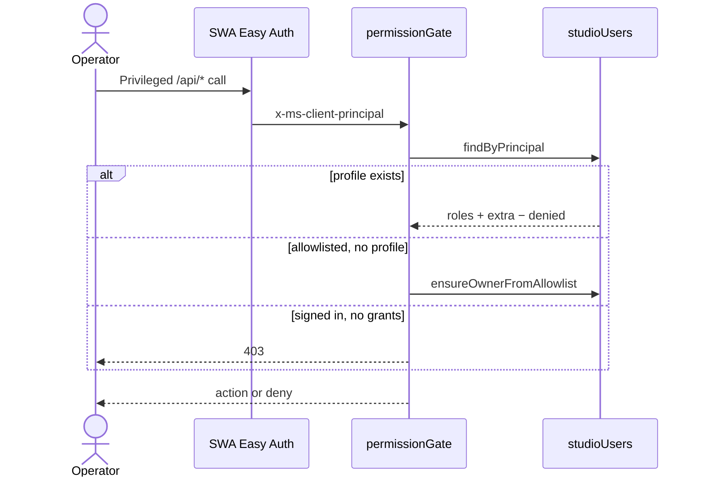

# Authentication and authorization

**Audience:** Agents, implementers  
**Last updated:** 2026-08-23  
**Scope:** How Studio proves identity, how it grants capabilities, and the permission catalog. This is the architecture SoT for authn/authz — not a backlog. Phased work stays in [`docs/plans/`](../plans/). Store shapes for profiles live in [`data-persistence.md`](./data-persistence.md). Operator steps live in [`manage-access.md`](../runbooks/manage-access.md).

**Keep this document current:** when a PR changes login gates, the permission catalog, role bundles, bootstrap, or how APIs authorize, update the matching sections and mermaid **in that same PR**, then bump **Last updated**. Agent contract: [`.cursor/rules/studio-auth.mdc`](../../.cursor/rules/studio-auth.mdc).

## Two problems, two systems

| Layer | Question | Answered by |
|-------|----------|-------------|
| **Authentication** | Who is calling? | Microsoft Entra + SWA Easy Auth (`x-ms-client-principal`) |
| **Authorization** | What may they do? | Application catalog on `studioUsers` rows (`api/src/lib/permissions.js`) |

Sign-in is not permission to act. A completed Entra login may open `/studio`, `/studio/help`, and `/studio/health`. Hub tiles, People, publish, and Access require discrete permission IDs on the caller’s profile. Every privileged Function re-checks with `permissionGate()`.



## Not Studio roles

These platform identities must never be conflated with the Studio **Super Administrator** role:

| Platform concept | What it is | Studio relationship |
|------------------|------------|---------------------|
| Azure RBAC **Owner** | Subscription / resource-group control plane | Infrastructure only. Never assigned as a stand-in for Studio access. |
| Entra **app owner** | Who can edit the app registration | Terraform / operators. Not a Studio permission. |
| Entra **Assignment required** | Enterprise-app Users and groups gate | **Must stay off** (`require_app_role_assignment = false`). Turning it on yields `AADSTS50105` and blocks login before the app can authorize. |
| SWA `authenticated` | Route requires a login | Identity gate only. |
| GitHub `owner/repo` | Repository path | Unrelated. |
| GSC / Azure Budget **Owner** | Vendor console role | Unrelated. |

Studio does **not** use Entra app roles for authorization. There is no “Owner” app role on the SWA registration.

## Authentication

1. **Entra app registration** (Terraform, `AzureADMyOrg`) — staging and prod are separate apps in the same tenant.
2. **SWA Authentication** presents `x-ms-client-principal` to Functions (`authLevel: 'anonymous'` because SWA already identified the caller).
3. **Route rules** require `authenticated` for `/studio`, `/studio/*`, and `/api/*`.

Anonymous exceptions (same `private, no-store` cache; not Studio login):

| Route | Proof |
|-------|-------|
| `POST /api/contactInquiry` | Cloudflare Turnstile + schema |
| `GET /api/lessonPayConfig` | Feature flag + sanitized Payment Link URLs |
| `POST /api/stripeWebhook` | Stripe signature |

Local Functions (`AZURE_FUNCTIONS_ENVIRONMENT=Development`) skip the SWA principal and grant the **full catalog** so `func start` works without headers.

## Authorization

### Source of truth

Table Storage `studioUsers` (partition `studio`). Each profile stores:

- Identity keys (`userId`, `userDetails`, `emails[]`) matched case-insensitively against the SWA principal
- **Roles** (named bundles)
- **Extra permissions** (grant one catalog ID without a role)
- **Denied permissions** (strip an ID even if a role includes it)
- **Status** (`active` / `disabled` — disabled → empty effective permissions)

Effective permissions are computed, not stored:

```
permissions = expand(roles ∪ extraPermissions) − deniedPermissions
```

`people.write` implies `people.read`. `users.manage` implies `users.read`. Unknown role/permission IDs are ignored.

### Permission catalog

Canonical IDs live in [`api/src/lib/permissions.js`](../../api/src/lib/permissions.js). Add a capability by adding an ID here — do not invent ad-hoc checks in handlers.

| ID | Meaning | Enforced on |
|----|---------|-------------|
| `content.publish` | Compose, preview, and publish the public site | Publish / upload / discrete / publish status (`publisherGate()`) |
| `people.read` | View People list and contact details | `GET /api/contacts` |
| `people.write` | Create, update, archive contacts (implies `people.read`) | `POST`/`PATCH` contacts |
| `users.read` | View Access profiles | `GET /api/studioUsers` |
| `users.manage` | Assign roles and discrete permissions (implies `users.read`) | Access writes at `/studio/access` |

### Role catalog

Roles are UI/operator bundles. The picker shows these labels only:

| Role id | Label | Permissions |
|---------|-------|-------------|
| `super_administrator` | Super Administrator | Full catalog |
| `publisher` | Publisher | `content.publish` |
| `people` | People | `people.read`, `people.write` |
| `people_reader` | People (view only) | `people.read` |

**Legacy alias:** stored id `owner` still expands to the Super Administrator bundle so existing Table rows keep working. Writes canonicalize to `super_administrator`. The Access UI does not offer “Owner” as a role.

`ROLE.OWNER` in code is a deprecated alias of `ROLE.SUPER_ADMINISTRATOR` (`super_administrator`).

### Bootstrap (`ALLOWED-USER-IDS`)

The Key Vault allowlist (`ALLOWED_USER_IDS` in SWA) is **not** a second permission model. The first Studio session for an allowlisted caller with no profile writes a **Super Administrator** row (`ensureOwnerFromAllowlist`). After that the table is SoT:

- Edit `/studio/access` to grant or revoke publish, People, or Access
- Removing someone from the allowlist does **not** disable an existing profile
- Adding a new allowlist token still bootstraps Super Administrator on next sign-in (emergency). Prefer `/studio/access`

### Resolution



Hub UI reads `GET /api/studioSession` (same payload as publisher status) and shows tiles from `permissions[]`. That is convenience only. The API is the enforcement point.

## Contrast: who can sign in vs who can act

| Can complete Entra login | Has a `studioUsers` profile with grants | Result |
|--------------------------|-----------------------------------------|--------|
| No | — | Redirect to login |
| Yes | No | Studio/help/health only; hub tiles hidden; APIs 403 |
| Yes | Super Administrator | Full catalog |
| Yes | Publisher / People / extras | Those IDs only |

## Source map

| Topic | Code |
|-------|------|
| Permission + role catalog | `api/src/lib/permissions.js` |
| Access resolution + gates | `api/src/lib/studioAccess.js` |
| Profile store | `api/src/lib/users.js` |
| Principal parsing | `api/src/lib/auth.js` |
| Access HTTP | `api/src/functions/studioUsers.js` |
| Access UI | `src/pages/studio/access.astro` |
| Entra / assignment-required | `infra/modules/portfolio/entra.tf` |
| SWA route rules | `staticwebapp.config.json` / `public/staticwebapp.config.json` |
| Operator runbook | [`docs/runbooks/manage-access.md`](../runbooks/manage-access.md) |
| Profile schema | [`data-persistence.md`](./data-persistence.md) §1.2 |
| Agent rule | [`.cursor/rules/studio-auth.mdc`](../../.cursor/rules/studio-auth.mdc) |
