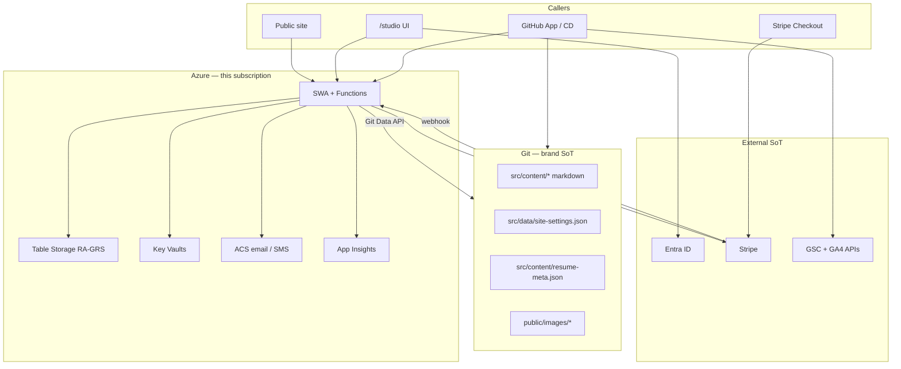
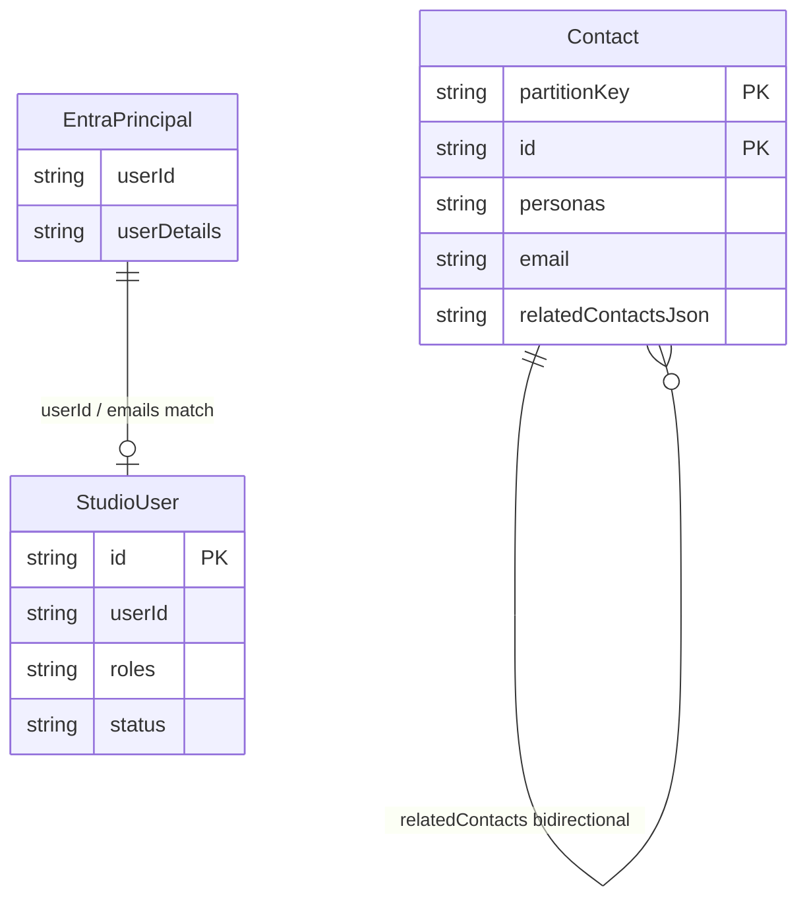
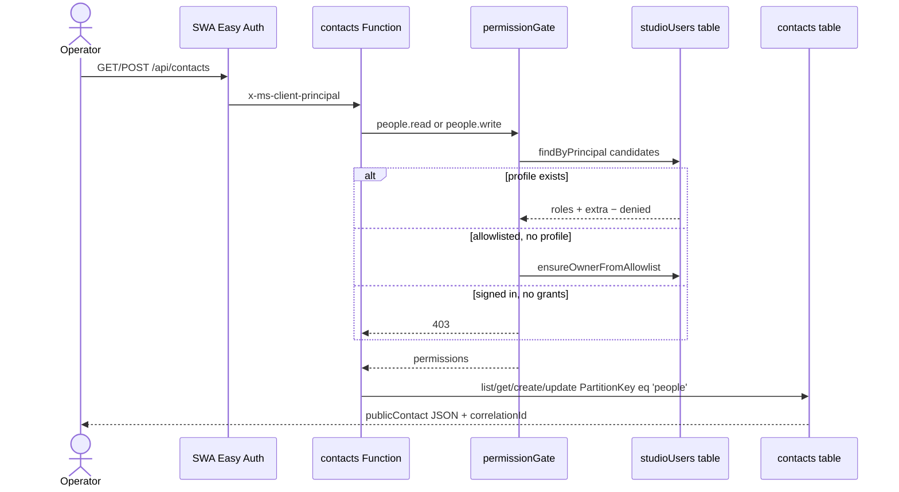
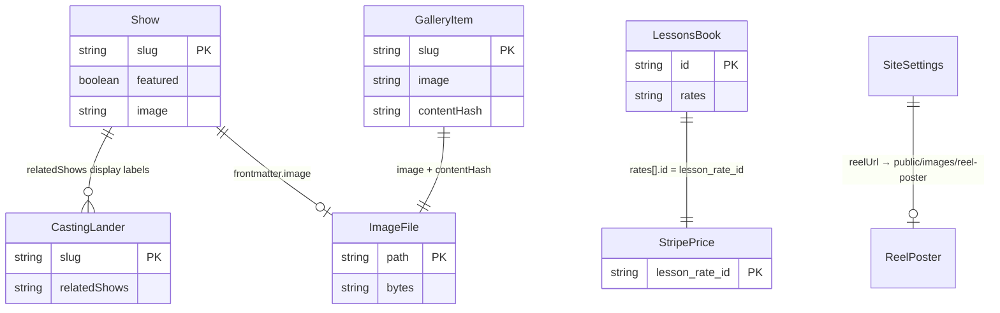
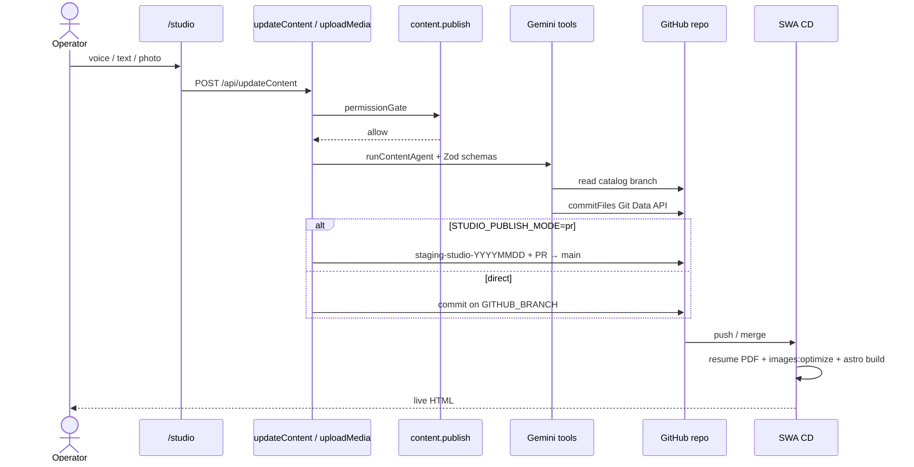
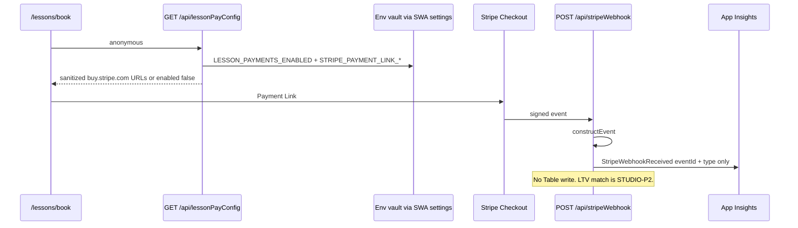
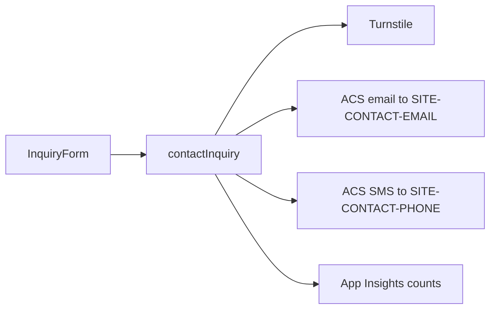

# Data persistence

**Audience:** Agents, implementers  
**Last updated:** 2026-08-23  
**Scope:** Where durable data lives today, the record shapes, how records relate, and the access paths. This is the architecture SoT for stores — not a backlog. Phased work stays in [`docs/plans/`](../plans/).

**Keep this document current:** when a PR changes a store, schema, relation, or access path, update the matching sections, mermaid, and source map **in that same PR**, then bump **Last updated**. Agent contract: [`.cursor/rules/data-persistence.mdc`](../../.cursor/rules/data-persistence.mdc) and [AGENTS.md](../../AGENTS.md).

There is **no application database**. Durable records are split across **git** (public brand), **Azure Table Storage** (Studio People + access profiles), **Stripe** (money), and **Key Vault** (secrets). Inquiries and Stripe webhook events are **not** written to a store.

## Systems of record

| Concern | Store | What lives there | What does not |
|---------|-------|------------------|---------------|
| **Public brand** | Git (`src/content/`, `src/data/`, `public/`) | Shows, news, gallery, pages, casting landers, site settings, resume meta, original images | Studio contacts, payments, secrets |
| **Relationships** | Azure Table `contacts` | People CRM: personas, notes, related-contact links | Stripe charges, calendar events |
| **Authorization** | Azure Table `studioUsers` | Roles + discrete permissions per Entra identity | Login itself (Entra) |
| **Money** | Stripe (test on staging, live on prod) | Products, prices, Payment Links, Checkout / PaymentIntents | Student LTV in Studio (`STUDIO-P2` planned) |
| **Secrets / config** | Azure Key Vault → SWA app settings | API keys, allowlist, ACS, Payment Link URLs | Business records |
| **Time** | Google Calendar | *Planned* (`STUDIO-P3`) — not persisted here | — |
| **Identity** | Microsoft Entra | Who can complete login | Permission to act |

**Cheap store first:** People and profiles use Table Storage (Standard **RA-GRS**). Do not add PostgreSQL until list/query needs force it; a new billable SKU must update [`cost-and-quotas.md`](../runbooks/cost-and-quotas.md) and the subscription budget in the same PR.



---

## 1. Azure Table Storage (Studio CRM + access)

**Infra:** [`infra/modules/portfolio/studio_crm.tf`](../../infra/modules/portfolio/studio_crm.tf)  
**Stores:** [`api/src/lib/contacts.js`](../../api/src/lib/contacts.js), [`api/src/lib/users.js`](../../api/src/lib/users.js)  
**Geo reads:** [`api/src/lib/tableGeo.js`](../../api/src/lib/tableGeo.js)

| Environment | Account | Tables | Replication |
|-------------|---------|--------|-------------|
| Staging | `stelysecrmstaging` | `contacts`, `studioUsers` | Standard RA-GRS (eastus2 → Central US) |
| Production | `stelysecrmprod` | `contacts`, `studioUsers` | Same |

Connection string is written into SWA app settings at apply (`STUDIO_CRM_STORAGE_CONNECTION_STRING`). Table names: `STUDIO_CRM_TABLE_NAME` (`contacts`), `STUDIO_USERS_TABLE_NAME` (`studioUsers`). Values are never logged or committed.

**Reads** go to the primary first and fall back to the paired-region secondary when the primary is unreachable (timeouts / 5xx / network). **Writes** stay on the primary until an operator account failover — the secondary is read-only.

### 1.1 Contact (`contacts` table)

One row = one person. Partition = constant `people` (`STUDIO_CONTACTS_PARTITION`). Row key = contact id (UUID on create; `seed-people-NN` for staging seed). Staging and prod already use separate storage accounts — that is the environment boundary, not a per-user partition.

| Property | Table column | Type | Notes |
|----------|--------------|------|--------|
| `id` | `RowKey` | string | UUID, or `seed-people-01`…`15` |
| — | `PartitionKey` | `"people"` | Always. One CRM per deployment. |
| `displayName` | `displayName` | string | Required; max 200 |
| `email` | `email` | string | Optional; unique among **non-archived** rows in the CRM |
| — | `emailKey` | string | Lowercased email for matching (not returned to the UI) |
| `phone` | `phone` | string | Optional; max 40 |
| `personas` | `personasJson` | string[] JSON | One or more of `student`, `parent`, `agent`, `casting`, `alumni` |
| `notes` | `notes` | string | Max 8000 |
| `archived` | `archived` | boolean | Soft delete; hidden from default list |
| `studentRateCents` | `studentRateCents` | number \| omitted | Monetary; UI also accepts `studentRateUsd` |
| `studentFormat` | `studentFormat` | `nyc` \| `zoom` \| `""` | Lesson format |
| `studentPackageRemaining` | `studentPackageRemaining` | number \| omitted | 0–500 |
| `studentLastLesson` | `studentLastLesson` | `YYYY-MM-DD` \| `""` | Day only |
| `agentAgency` | `agentAgency` | string | Max 200 |
| `agentTerritory` | `agentTerritory` | string | Max 200 |
| `agentLastSubmission` | `agentLastSubmission` | string | Max 400 |
| `agentLastBooking` | `agentLastBooking` | string | Max 400 |
| `agentNextStep` | `agentNextStep` | string | Max 400 |
| `relatedContacts` | `relatedContactsJson` | `{ id, relation }[]` | Max 20; see relations |
| `createdAt` / `updatedAt` | same | ISO-8601 | Server-set |
| `etag` | OData etag | string | Optimistic concurrency (`If-Match` / body `etag`) |

**Personas** are tags on one person, not separate tables. A parent who is also an alumni has `personas: ["parent", "alumni"]`.

**Uniqueness:** Active (non-archived) emails are unique in the CRM. Archived rows do not block reuse. List/search is in-partition scan + in-memory filter (`q` matches display name or email; `persona` is an exact tag). Default page size 10, max 50. `directory=1` returns the full filtered set (related-contact picker).

**Seed:** Staging CD runs [`scripts/seed-studio-people.mjs`](../../scripts/seed-studio-people.mjs) **after Terraform apply and before SWA upload**. Fifteen fictional rows (`seed-people-01`…`15`), one of each persona mix, last names A–P so pagination is obvious, all in the `people` partition. Prod is not seeded. Local: `npm run studio:seed-people` against Azurite.

### 1.2 Studio user profile (`studioUsers` table)

One row = one authorized operator. Single partition `studio`. Row key = profile UUID (not the Entra object id).

| Property | Table column | Type | Notes |
|----------|--------------|------|--------|
| `id` | `RowKey` | UUID | Profile id used by `/api/studioUsers/{id}` |
| — | `PartitionKey` | `"studio"` | Always |
| `userId` | `userId` | string | Entra object id when known |
| `userDetails` | `userDetails` | string | UPN / email-shaped claim |
| `emails` | `emailsJson` | string[] JSON | Extra match keys |
| `displayName` | `displayName` | string | Access UI only |
| `roles` | `rolesJson` | string[] JSON | `super_administrator` (legacy `owner` still accepted), `publisher`, `people`, `people_reader` |
| `extraPermissions` | `extraPermissionsJson` | string[] JSON | Grant one catalog ID without the role |
| `deniedPermissions` | `deniedPermissionsJson` | string[] JSON | Strip an ID even if a role includes it |
| `status` | `status` | `active` \| `disabled` | Disabled → empty permissions |
| `createdAt` / `updatedAt` | same | ISO-8601 | Server-set |
| `etag` | OData etag | string | Optimistic concurrency |

Effective permissions are computed, not stored:

```
permissions = expand(roles ∪ extraPermissions) − deniedPermissions
```

Catalog and implication rules live in [`api/src/lib/permissions.js`](../../api/src/lib/permissions.js):

| Permission | Implied |
|------------|---------|
| `content.publish` | — |
| `people.write` | `people.read` |
| `users.manage` | `users.read` |

| Role | Permissions |
|------|-------------|
| `super_administrator` | Full catalog (UI label **Super Administrator**; stored `owner` still expands to this bundle) |
| `publisher` | `content.publish` |
| `people` | `people.read`, `people.write` |
| `people_reader` | `people.read` |

**Identity match:** `findByPrincipal` lists the partition and matches any of `userId`, `userDetails`, `emails[]` (lowercased) against SWA principal candidates. There is no secondary index.

**Bootstrap:** `ALLOWED-USER-IDS` (env Key Vault → `ALLOWED_USER_IDS`) is **not** a second permission model. The first session for an allowlisted caller with no profile writes a **Super Administrator** row (`ensureOwnerFromAllowlist`). After that the table is SoT. Removing someone from the allowlist does not disable an existing profile. Authn vs authz: [`authentication-authorization.md`](./authentication-authorization.md).

### 1.3 Relations (Table Storage)



**One CRM per deployment.** Contacts always use partition `people`. Operators who hold `people.read` / `people.write` see the same list. Staging vs prod isolation is the storage account, not a tenant key on the profile. Handlers do not take a partition or owner id from the request body.

**Related contacts** are a bidirectional adjacency list on the same partition:

| Relation written on A | Inverse written on B |
|-----------------------|----------------------|
| `parent` | `student` |
| `student` | `parent` |
| `related` | `related` |

`syncRelatedLinks` updates the other row on create/update. Self-links are rejected. Missing targets fail validation. Removing a link strips the inverse. Max 20 related ids per person. This is **not** a foreign-key constraint — the other row must already exist.

There is **no** stored link from a contact to Stripe customers, Calendar events, or git content.

### 1.4 Access flow — People



HTTP surface ([`api/src/functions/contacts.js`](../../api/src/functions/contacts.js)):

| Method | Route | Permission | Store op |
|--------|-------|------------|----------|
| `GET` | `/api/contacts` | `people.read` | `list` (q, persona, page, includeArchived, directory) |
| `POST` | `/api/contacts` | `people.write` | `create` |
| `GET` | `/api/contacts/{id}` | `people.read` | `get` |
| `PATCH` | `/api/contacts/{id}` | `people.write` | `update` (etag) |

Access admin ([`api/src/functions/studioUsers.js`](../../api/src/functions/studioUsers.js)) uses `users.read` / `users.manage` against the same `studioUsers` table. Session payload (`GET /api/studioSession`) is UI convenience only — every privileged call re-checks the catalog.

---

## 2. Git — public brand

Astro collections are defined in [`src/content.config.ts`](../../src/content.config.ts). Zod schemas are shared with the API in [`api/src/lib/contentSchemas.js`](../../api/src/lib/contentSchemas.js) so Studio publish and `astro check` validate the same shapes.

### 2.1 Collections

| Collection | Path | Route | Identity |
|------------|------|-------|----------|
| `shows` | `src/content/shows/*.md` | `/shows` (list; no per-show URL) | Filename slug |
| `news` | `src/content/news/*.md` | `/news`, `/news/[slug]` | Filename slug |
| `gallery` | `src/content/gallery/*.md` | `/gallery` | Filename slug |
| `pages` | `src/content/pages/*.md` | `/about`, `/lessons`, `/lessons/book`, … | Entry id |
| `casting` | `src/content/casting/*.md` | `/for/[slug]` inbound SEO only | Filename slug |

Pages also consume **JSON** that is not an Astro collection:

| File | Schema | Consumers |
|------|--------|-----------|
| `src/data/site-settings.json` | `siteSettingsSchema` | Homepage reel/bio/press/performer facts; Studio discrete tools |
| `src/content/resume-meta.json` | informal (PDF script) | `scripts/generate-resume-pdf.mjs` → `public/downloads/elyse-tindall-resume.pdf` |

### 2.2 Content models

**Show** (`showFrontmatterSchema`)

| Field | Required | Notes |
|-------|----------|-------|
| `title`, `year`, `synopsis` | yes | |
| `role`, `venue` | no | Venue = `[Theater Name] - [City], [ST]` |
| `image`, `imageFocus` | no | `imageFocus` default `center top` |
| `videoUrl` | no | URL |
| `category` | no | `musical` \| `play` \| `cabaret` \| `film` (default musical) |
| `featured` | no | Homepage takes **three newest** featured by year then `order` |
| `order` | no | Lower = newer within a year |

**News** — `title`, `date`, `description`; optional `tags`, `image`, `videoUrl`; `draft` hides the post.

**Gallery** — `image` (required path under `public/`); optional `caption`, `tags`, `order`, `focus`; `contentHash` = SHA-256 of the **raw committed** image bytes (never a derived variant). Studio injects the hash on upload.

**Page** — `title`, `description`; optional `updated`, `format`, `scheduling`. `/lessons/book` additionally requires exactly two `rates`: `30min` and `60min` (`price` display string + `priceAmount` USD). Those amounts are the SoT for Stripe prices (`scripts/read-lesson-rates.mjs` at env apply).

**Casting lander** — `keyword`, `title`, `description`; `relatedSkills[]`, `relatedShows[]` (display labels, not foreign keys); `cta` default `Request materials`.

**Site settings** — `reelUrl`, `reelTitle`, `shortBio`, `pressQuote { quote, attribution }`, `performer { vocalType, vocalRange, union, availability, playingAge?, ethnicity?, height? }`.

**Resume meta** — name, location, specs line, training[], specialSkills[], residencies[{ years, company }], `contactFallbacks` (email/phone used only when KV site-contact secrets are unset at PDF generate time).

### 2.3 Relations (git)



- **Casting → shows** is a **label list**, not a slug join. `LandingLayout` renders the strings and a “View all shows” link. Do not treat `relatedShows` as `CollectionEntry` ids.
- **Gallery / show image** paths point at files in `public/images/`. Build derives long-cache variants under `public/images/_derived/{sha}/` (not a second SoT).
- **Lessons book → Stripe** is the only cross-system foreign key that is enforced at apply: `rates[].id` ∈ {`30min`,`60min`} becomes Stripe `metadata.lesson_rate_id`.

### 2.4 Access flow — Studio publish



| Mode | Env | Write target |
|------|-----|--------------|
| `pr` | Staging SWA | Dated `staging-studio-YYYYMMDD` branch + PR into `main` |
| `direct` | Prod SWA, local default | `GITHUB_BRANCH` (usually `main`) |

Catalog **reads** use `resolveContentBranch()`: in PR mode, today’s staging branch if it already exists, else `main`. Binary photos go to `public/images/photos/{timestamp}-{slug}.jpg` via `uploadMedia` or as part of a gallery publish. Reel poster fetch writes `public/images/` when the reel URL changes.

Public pages **read** collections at **build time** (`getCollection` / `getEntry`). There is no runtime query of git from the anonymous site.

---

## 3. Stripe — money

**Catalog Terraform:** [`infra/modules/stripe_catalog/`](../../infra/modules/stripe_catalog/)  
**Env wiring:** [`infra/modules/portfolio/stripe.tf`](../../infra/modules/portfolio/stripe.tf)  
**API:** [`api/src/lib/lessonPayConfig.js`](../../api/src/lib/lessonPayConfig.js), [`api/src/functions/stripeWebhook.js`](../../api/src/functions/stripeWebhook.js)

| Object | Created by | Stored where | Linked how |
|--------|------------|--------------|------------|
| Product (voice lesson) | Env Terraform | Stripe | `metadata.lesson_rate_id` = `30min` \| `60min` |
| Price (USD cents, one-time) | Env Terraform | Stripe | Same metadata; cents from `lessons-book.md` |
| Webhook endpoint | Env Terraform | Stripe | URL `https://{host}/api/stripeWebhook` |
| Payment Link | `scripts/upsert-stripe-payment-links.mjs` | Stripe + **env vault** `STRIPE-PAYMENT-LINK-*` | One link per rate |
| Checkout / PaymentIntent / Charge | Stripe Checkout | Stripe | Not copied into Table Storage |

API keys live in **`kv-elyse-shared`** (`STRIPE-TEST-*` / `STRIPE-LIVE-*`). Staging consumes test keys; prod consumes live. Webhook signing secret and Payment Link URLs live in the **environment** vault so catalogs promote independently.



`GET /api/lessonPayConfig` never returns secret/restricted keys. Links must be `https://buy.stripe.com/…`. Prod flag is **false** until go-live.

Webhook handler **verifies and telemeters** (`checkout.session.*`, `payment_intent.*`, `charge.refunded`). It does not persist the payload or match a contact by email yet.

---

## 4. Key Vault — secrets, not records

| Vault | Scope | Typical names |
|-------|-------|----------------|
| `kv-elyse-shared` | Bootstrap | `SITE-CONTACT-*`, Turnstile, ACS, `ALERT-*`, `GA-*`, `GSC-*`, `MONITOR-*`, Stripe **API keys** |
| `kv-elyse-staging` / `kv-elyse-prod` | Env stacks | `GEMINI-API-KEY`, GitHub App id/install/PEM, `ALLOWED-USER-IDS`, Entra client secret, `STRIPE-WEBHOOK-SECRET`, `STRIPE-PAYMENT-LINK-*` |

Managed Functions **do not** resolve `@Microsoft.KeyVault(...)` app settings. Terraform apply and [`scripts/sync-swa-api-secrets.sh`](../../scripts/sync-swa-api-secrets.sh) copy live values into SWA. Exception: `AAD_CLIENT_SECRET` stays a Key Vault reference because the SWA auth platform resolves it.

**Never** treat vault contents as CRM, content, or payment history. Rotate via [`rotate-secrets.md`](../runbooks/rotate-secrets.md). Do not write secret values into this doc, scorecards, or PRs.

---

## 5. Transient and derived (not business SoT)

### 5.1 Contact inquiries — notify only

[`POST /api/contactInquiry`](../../api/src/functions/contactInquiry.js) validates Turnstile + Zod, then sends ACS **email** (and SMS when `ACS_SMS_FROM` is a real E.164). Payload fields: `type` (`casting` \| `lesson`), `name`, `preferredContact`, `email` / `phone`, `organization`, `format` (`nyc` \| `zoom`, required for lesson), `message`.

Nothing is written to Table Storage or git. `STUDIO-P4` (inquiry → CRM) is planned. Telemetry records type + correlation id, not PII.



### 5.2 App Insights

Custom events (`StudioCrmOp`, `StudioAccessDenied`, `StripeWebhookReceived`, …) plus exceptions keyed by `correlationId`. Used for SLOs and the monthly scorecard — **not** a queryable CRM. Never send Studio diagnostics to GA4.

### 5.3 Ops artifacts in git

| Artifact | Writer | Role |
|----------|--------|------|
| `docs/ops/operational-excellence-scorecard.md` + `scorecard-evaluation.json` | Monthly `Ops: scorecard` workflow | Living scores / spend / visits |
| `docs/ops/search-signals/` | Monthly `Search: signals` workflow | GSC + GA extract (paths, bands; no PII) |
| `infra/*/terraform.tfstate` remote | `stelysetfstateeu2` / `tfstate` container | Infra state only (`broadway-portfolio/{staging,prod}.tfstate`) |

CD ignores scorecard-only and search-signals-only pushes.

### 5.4 Entra / SWA principal

`x-ms-client-principal` proves login. It is not stored. Profiles copy `userId` / emails at bootstrap or Access-admin create so later requests can match.

---

## 6. What is not persisted yet

From [`studio-teaching-business.md`](../plans/studio-teaching-business.md):

| Planned ID | Intended store | Today |
|------------|----------------|-------|
| `STUDIO-P1-006` | Export file (emailed / download) | People live only in Table Storage |
| `STUDIO-P2-*` | Stripe ↔ contact email match; LTV fields | Webhook is telemetry-only |
| `STUDIO-P3-*` | Google Calendar (busy + write-back) | No calendar store |
| `STUDIO-P4-*` | Inquiry → contact row | ACS notify only |
| `STUDIO-P5-*` | Month report / public free-busy | Stripe Dashboard / email |

Do not invent a second calendar or a Studio ledger that can drift from Stripe.

---

## 7. Privacy and logging

- **No PII in git** except public brand copy (show titles, site settings, resume). Student/agent names, emails, phones, notes, tokens, alert addresses, and Payment Link secrets never land in the repo, scorecards, or PR bodies.
- Function logs and App Insights may include **ids, kinds, correlationId, route** — not display names, emails, phones, or notes.
- `publicContact` / `publicUser` return PII to the **authorized** Studio UI over `private, no-store` responses. That is not a public API.
- Optimistic concurrency: stale `etag` → 409 (`CrmConflictError` / `AccessConflictError`).

---

## 8. Local development

| Store | Local stand-in |
|-------|----------------|
| Tables | Azurite or a real storage connection in `api/local.settings.json`; `MemoryTableClient` in unit tests |
| Git publish | GitHub App creds or `GITHUB_TOKEN`; `STUDIO_PUBLISH_MODE=direct` by default |
| Authz | `AZURE_FUNCTIONS_ENVIRONMENT=Development` grants the **full catalog**; contacts use partition `people` |
| Stripe | Test keys + test Payment Links; webhook verify-only if the secret is a placeholder |
| Inquiries | ACS settings in local.settings; Turnstile test keys |

`astro dev` does **not** proxy `/api/*` to Functions on :7071.

---

## 9. Source map

| Topic | Code |
|-------|------|
| Contact schema + store | `api/src/lib/contacts.js` |
| User profile schema + store | `api/src/lib/users.js` |
| RA-GRS table client | `api/src/lib/tableGeo.js` |
| Permission catalog | `api/src/lib/permissions.js` |
| Access resolution | `api/src/lib/studioAccess.js` |
| Content Zod schemas | `api/src/lib/contentSchemas.js` |
| Astro collections | `src/content.config.ts` |
| Git commits | `api/src/lib/github.js`, `api/src/lib/gemini.js` |
| CRM HTTP | `api/src/functions/contacts.js` |
| Access HTTP | `api/src/functions/studioUsers.js` |
| Inquiry HTTP | `api/src/functions/contactInquiry.js` |
| Pay config / webhook | `api/src/functions/lessonPayConfig.js`, `stripeWebhook.js` |
| Table infra | `infra/modules/portfolio/studio_crm.tf` |
| Stripe catalog | `infra/modules/stripe_catalog/main.tf` |
| People seed | `scripts/seed-studio-people.mjs` |
| Access runbook | [`docs/runbooks/manage-access.md`](../runbooks/manage-access.md) |
| Authn / authz architecture | [`authentication-authorization.md`](./authentication-authorization.md) |
| Payments plan | [`docs/plans/lesson-payments.md`](../plans/lesson-payments.md) |
| Studio backlog | [`docs/plans/studio-teaching-business.md`](../plans/studio-teaching-business.md) |
| Keep-in-sync rule | [`.cursor/rules/data-persistence.mdc`](../../.cursor/rules/data-persistence.mdc) |
