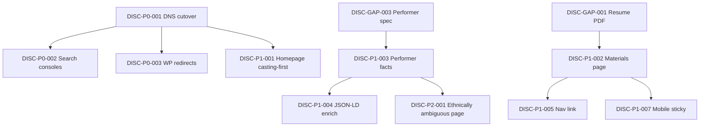

# Casting discoverability — assessment & implementation backlog

**Artifact ID:** `ELYSE-DISC-001`  
**Version:** 1.0  
**Last updated:** 2026-08-02  
**Audience:** Agents, implementers, Elyse (content owner)  
**Scope:** Public site discoverability for casting directors, representation, and answer engines — not voice-lesson marketing.

For Google Search Console, GA4 measurement, and technical SEO that feeds those tools, see the phased plan [search-and-analytics.md](search-and-analytics.md) (`SEARCH-*`). Overlapping cutover/console items keep their `DISC-P0-*` IDs here and are cross-linked.

Use the **Action ID** column (`DISC-*`) to reference items in PRs, issues, Studio prompts, and commits.

Example PR title: `DISC-P1-003: Add performer facts block to About`

---

## How to use this document

| Section | Purpose |
|---------|---------|
| [Rubric](#rubric-disc-rub) | Scoring dimensions — reuse for future audits |
| [Baseline scores](#baseline-scores-disc-score) | Snapshot as of 2026-08-02 (WordPress live vs Astro repo) |
| [Action backlog](#action-backlog) | Implementable work items with IDs, acceptance criteria, and file hints |
| [Dependencies](#dependency-graph) | What blocks what |
| [Channel playbooks](#channel-playbooks-disc-ch) | Mobile, desktop, and AI-specific requirements |
| [Content inventory gaps](#content-inventory-gaps-disc-gap) | Facts and assets needed from Elyse before/during implementation |

**Status values:** `planned` · `in_progress` · `blocked` · `done` · `wont_fix`

---

## Rubric (`DISC-RUB`)

Each dimension scored **0–5** (0 = invisible, 5 = industry-standard). Weights reflect casting-director and agent priorities.

| ID | Dimension | Weight | Score 5 looks like |
|----|-----------|--------|-------------------|
| `DISC-RUB-01` | Technical findability | 15% | Indexed, sitemap, canonicals, fast HTTPS, structured data |
| `DISC-RUB-02` | Search intent match | 20% | Ranks for role / type / geo queries, not only name |
| `DISC-RUB-03` | Materials access | 20% | Reel + headshot + resume in &lt;2 taps; email optional for follow-up |
| `DISC-RUB-04` | Type & range clarity | 15% | Playing age, vocal range, ethnicity/presenting, union, availability |
| `DISC-RUB-05` | Credit authority | 10% | Current credits, press, third-party validation |
| `DISC-RUB-06` | Mobile casting UX | 10% | Reel + contact without scrolling past coaching |
| `DISC-RUB-07` | Desktop depth | 5% | Filterable credits, gallery, professional EPK flow |
| `DISC-RUB-08` | AI / answer-engine readiness | 5% | Machine-readable facts; consistent entities across the web |

**Grade bands:** 0–39% Poor · 40–59% Developing · 60–74% Competitive · 75%+ Strong

Weighted score formula:

```
Σ (dimension_score / 5 × weight)
```

---

## Baseline scores (`DISC-SCORE`)

Snapshot **2026-08-02**. Re-score after `DISC-P0-001` (cutover) and after each tier ships.

### Live site — WordPress at `elysetindall.com` (`DISC-SCORE-LIVE`)

| ID | Channel | Weighted | Grade |
|----|---------|----------|-------|
| `DISC-SCORE-LIVE-MOB` | Mobile search | 34% | Poor |
| `DISC-SCORE-LIVE-DSK` | Desktop search | 38% | Poor |
| `DISC-SCORE-LIVE-AI` | AI search | 28% | Poor |

| Rubric ID | Score (0–5) | Notes |
|-----------|-------------|-------|
| `DISC-RUB-01` | 2.0 | HTTPS yes; no sitemap; no modern schema |
| `DISC-RUB-02` | 1.5 | Name-only; no `/for/*` pages |
| `DISC-RUB-03` | 2.0 | Reel buried; no resume/headshot download |
| `DISC-RUB-04` | 1.0 | No range, playing age, ethnicity, union |
| `DISC-RUB-05` | 2.5 | Anastasia news good; stale featured credits |
| `DISC-RUB-06` | 2.0 | WP sidebar layout; not casting-first |
| `DISC-RUB-07` | 2.5 | Basic list; unprofessional stats widget |
| `DISC-RUB-08` | 1.0 | No JSON-LD |

### Repo site — Astro (not yet on apex domain) (`DISC-SCORE-REPO`)

| ID | Channel | Weighted | Grade |
|----|---------|----------|-------|
| `DISC-SCORE-REPO-MOB` | Mobile search | 58% | Developing |
| `DISC-SCORE-REPO-DSK` | Desktop search | 66% | Competitive |
| `DISC-SCORE-REPO-AI` | AI search | 52% | Developing |

| Rubric ID | Score (0–5) | Notes |
|-----------|-------------|-------|
| `DISC-RUB-01` | 4.5 | Sitemap, robots, canonicals, OG, JSON-LD — not live on apex |
| `DISC-RUB-02` | 3.5 | 16 `/for/*` pages; gaps on range, ethnicity, representation |
| `DISC-RUB-03` | 2.5 | Reel embedded; no PDF resume or headshot download |
| `DISC-RUB-04` | 2.0 | Narrative strong; no spec-sheet facts |
| `DISC-RUB-05` | 3.5 | 6 shows, 2 news posts; thin vs competitive NYC book |
| `DISC-RUB-06` | 3.0 | Hero CTA is “Book a Lesson”; lessons above performance |
| `DISC-RUB-07` | 4.0 | Clean credits, gallery, filters |
| `DISC-RUB-08` | 3.0 | Person schema; `knowsAbout` coaching-heavy; Instagram-only `sameAs` |

### Target after Tier 0 + Tier 1 (`DISC-SCORE-TARGET`)

| ID | Channel | Target |
|----|---------|--------|
| `DISC-SCORE-TARGET-MOB` | Mobile search | ~75% |
| `DISC-SCORE-TARGET-DSK` | Desktop search | ~80% |
| `DISC-SCORE-TARGET-AI` | AI search | ~70% |

---

## Action backlog

### Tier 0 — Blockers (do first)

| ID | Title | Status | Depends on | Primary files / runbooks |
|----|-------|--------|------------|--------------------------|
| `DISC-P0-001` | Cut over apex DNS to Astro SWA | `done` | — | [wordpress-to-azure-cutover.md](../runbooks/wordpress-to-azure-cutover.md), [dns-and-domain.md](../runbooks/dns-and-domain.md), [deploy-and-rollback.md](../runbooks/deploy-and-rollback.md) |
| `DISC-P0-002` | Submit sitemap to Google Search Console & Bing Webmaster Tools | `done` | `DISC-P0-001` | GSC property registered for `elysetindall.com`; residual indexing requests in [search-and-analytics.md](search-and-analytics.md) (`SEARCH-P0-004`) |
| `DISC-P0-003` | Configure 301 redirects from legacy WordPress URLs | `done` | — | [wordpress-to-azure-cutover.md](../runbooks/wordpress-to-azure-cutover.md) §2–3, `public/staticwebapp.config.json` |

<details>
<summary><code>DISC-P0-001</code> — Cut over apex DNS to Astro SWA</summary>

**Status:** `done` (apex serves Astro SWA).

**Acceptance criteria**

- [x] `https://elysetindall.com/` serves the Astro build (not EasyWP WordPress)
- [x] `https://elysetindall.com/sitemap-index.xml` returns 200
- [x] HTTPS valid on apex

**Operator runbook:** [wordpress-to-azure-cutover.md](../runbooks/wordpress-to-azure-cutover.md)

</details>

<details>
<summary><code>DISC-P0-002</code> — Submit sitemap to search consoles</summary>

**Status:** `done` (GSC property registered for `elysetindall.com`). Residual indexing requests: `SEARCH-P0-004` in [search-and-analytics.md](search-and-analytics.md).

**Acceptance criteria**

- [x] Google Search Console property verified for `elysetindall.com`
- [ ] Sitemap URL confirmed submitted/accepted in GSC (verify if unsure)
- [ ] Bing Webmaster Tools sitemap submitted (optional)
- [ ] Index coverage monitored for `/for/*` (ongoing)

**Operator runbook:** [wordpress-to-azure-cutover.md](../runbooks/wordpress-to-azure-cutover.md) §6

</details>

<details>
<summary><code>DISC-P0-003</code> — 301 redirects from legacy WordPress URLs</summary>

**Acceptance criteria**

- [x] Document all indexed WP URLs from EasyWP REST inventory / Search Console / site: search
- [x] Each legacy URL 301s to the closest Astro equivalent (one hop) in `public/staticwebapp.config.json`
- [ ] Spot-check 10 legacy URLs after DNS cutover

**Operator runbook:** [wordpress-to-azure-cutover.md](../runbooks/wordpress-to-azure-cutover.md) §2–3

</details>

---

### Tier 1 — Casting-first positioning (first implementation sprint)

| ID | Title | Status | Depends on | Primary files / runbooks |
|----|-------|--------|------------|--------------------------|
| `DISC-P1-001` | Reorder homepage for casting (hero CTAs + section order) | `done` | `DISC-P0-001` | `src/pages/index.astro`, `src/components/Hero.astro` |
| `DISC-P1-002` | Add `/materials` page with reel, downloads, and casting CTA | `done` | `DISC-P0-001`, `DISC-GAP-001`, `DISC-GAP-002` | New `src/pages/materials.astro`, `public/downloads/` |
| `DISC-P1-003` | Add performer facts block (range, type, union, availability) | `done` | `DISC-GAP-003` | `src/lib/site.ts`, `src/components/PerformerFacts.astro`, `src/pages/about.astro`, `src/pages/materials.astro` |
| `DISC-P1-004` | Enrich JSON-LD and `site.ts` for performer + AI discoverability | `planned` | `DISC-P1-003` | `src/lib/site.ts`, `src/components/Seo.astro`, `src/pages/index.astro` |
| `DISC-P1-005` | Add nav/footer link to Materials | `done` | `DISC-P1-002` | `src/lib/site.ts` (`nav`), `src/components/Footer.astro` |
| `DISC-P1-006` | Surface Tiffany King quote on site | `planned` | — | `src/pages/index.astro` or `src/pages/about.astro` |
| `DISC-P1-007` | Add sticky mobile “Materials” shortcut | `planned` | `DISC-P1-002` | `src/layouts/BaseLayout.astro` or new component |

<details>
<summary><code>DISC-P1-001</code> — Reorder homepage for casting</summary>

**Acceptance criteria**

- [x] Hero primary CTA: **Request materials** (mailto or `/materials`)
- [x] Hero secondary CTA: **Watch reel** (`#reel`)
- [x] “Book a Lesson” is not the primary hero CTA
- [x] Performance / reel section appears **above** the lessons module on homepage
- [x] Mobile first screen communicates actress + reel path without scrolling past lessons

**Brand note:** Lessons remain in nav and footer; this item only changes homepage priority for casting discoverability.

**Follow-up:** ~~Hero primary CTA used mailto until `/materials` existed.~~ Resolved in `DISC-P1-002` — hero now links to `/materials/`.

</details>

<details>
<summary><code>DISC-P1-002</code> — Add `/materials` page</summary>

**Acceptance criteria**

- [x] Route `/materials/` live and in sitemap
- [x] Embedded reel (same YouTube as `site.reelUrl`)
- [x] Download link: resume PDF (`/downloads/elyse-tindall-resume.pdf` or equivalent)
- [x] Download link: headshot (theatrical + commercial if available)
- [x] Email CTA with subject `Casting Inquiry` pre-filled
- [x] Page `title` / `description` optimized for “Elyse Tindall materials” queries
- [x] `noIndex` is **not** set
- [x] Update hero primary CTA in `src/components/Hero.astro`: change “Request materials” from `mailto:` to `/materials/` (see follow-up note on `DISC-P1-001`)

**Notes:** Theatrical headshot ships at `/downloads/elyse-tindall-headshot-theatrical.jpg`. Commercial headshot still outstanding (`DISC-GAP-002` partial). Resume PDF is generated from `src/content/shows` + `src/content/resume-meta.json` (`npm run resume:pdf`; also runs automatically as part of `npm run build`).

</details>

<details>
<summary><code>DISC-P1-003</code> — Performer facts block</summary>

**Acceptance criteria**

- [x] Visible block on About and Materials
- [x] Fields rendered (when provided in `site.ts` or content):
  - Playing age
  - Vocal range (e.g. belt/mix notation)
  - Ethnicity / presenting (e.g. ethnically ambiguous)
  - Union status (AEA / EMC / non-union)
  - Based in (NYC)
  - Availability / seeking representation (if applicable)
  - Chronological age and height (listed last)
- [x] Facts are plain HTML text (not image-only) for crawlers and AI
- [x] Copy reviewed and approved by Elyse before publish

Shipped facts in `site.performer`: playing age 15–28; vocal type (Mezzo-Soprano with an extended range); range D3-G6 (Belt: G5); ethnicity/presenting (White / Middle Eastern olive skin; Hispanic, Latina, Latin, Italian, Greek, Mediterranean, ethnically ambiguous); height 5'3" (160 cm); non-union; available. Full facts table on About and Materials (not Contact).
</details>

<details>
<summary><code>DISC-P1-004</code> — Enrich JSON-LD and site metadata</summary>

**Acceptance criteria**

- [ ] `knowsAbout` includes performance types (not only vocal coaching)
- [ ] `alumniOf` includes Broadway Artists Alliance and University of the Arts
- [ ] `sameAs` includes YouTube (performer channel) and any verified casting profiles
- [ ] Performer facts from `DISC-P1-003` reflected in Person schema where schema.org allows
- [ ] Casting pages inherit updated defaults from `Seo.astro` / `site.ts`

</details>

<details>
<summary><code>DISC-P1-005</code> — Nav/footer link to Materials</summary>

**Acceptance criteria**

- [ ] “Materials” (or “Casting”) in primary nav or footer on all public pages
- [ ] Link targets `/materials/`

</details>

<details>
<summary><code>DISC-P1-006</code> — Surface Tiffany King quote</summary>

**Acceptance criteria**

- [ ] Quote attributed: Tiffany King — “The funniest actor you’ve never seen.”
- [ ] Placed on homepage or About with appropriate editorial styling (no pill-stat strip per style guide)
- [ ] Visible on mobile without excessive scroll

</details>

<details>
<summary><code>DISC-P1-007</code> — Sticky mobile Materials shortcut</summary>

**Acceptance criteria**

- [ ] On viewports &lt; `md`, persistent bottom or top bar with “Materials” / “Reel” actions
- [ ] Does not obscure reel iframe controls
- [ ] Hidden on `/studio` and `/lessons/book` if distracting

</details>

---

### Tier 2 — Search intent expansion (2–4 week sprint)

| ID | Title | Status | Depends on | Primary files / runbooks |
|----|-------|--------|------------|--------------------------|
| `DISC-P2-001` | Casting page: ethnically ambiguous actress musical theatre | `planned` | `DISC-P1-003` | `src/content/casting/ethnically-ambiguous-actress.md` |
| `DISC-P2-002` | Casting page: belt vocalist musical theatre | `planned` | `DISC-P1-003` | `src/content/casting/belt-vocalist-musical-theatre.md` |
| `DISC-P2-003` | Casting page: mezzo-soprano musical theatre | `planned` | `DISC-P1-003` | `src/content/casting/mezzo-soprano-musical-theatre.md` |
| `DISC-P2-004` | Casting page: triple threat actress NYC | `planned` | — | `src/content/casting/triple-threat-actress-nyc.md` |
| `DISC-P2-005` | Casting page: seeking representation NYC | `planned` | Elyse approval | `src/content/casting/seeking-representation-nyc.md` |
| `DISC-P2-006` | Internal linking for `/for/*` pages | `planned` | — | `src/components/Footer.astro`, `src/pages/shows.astro`, `src/pages/about.astro` |
| `DISC-P2-007` | Casting index page listing all `/for/*` landers | `planned` | — | New `src/pages/for/index.astro` |
| `DISC-P2-008` | Individual show detail pages | `planned` | — | `src/pages/shows/[slug].astro`, show markdown bodies |
| `DISC-P2-009` | Add 2–3 vocal demo clips (16-bar song cuts) | `planned` | `DISC-GAP-004` | `src/pages/materials.astro`, `src/content/shows/*.md` or gallery |
| `DISC-P2-010` | Cross-link show credits → relevant casting pages | `planned` | `DISC-P2-006`, `DISC-P2-008` | Show templates, casting frontmatter |

<details>
<summary><code>DISC-P2-001</code> … <code>DISC-P2-005</code> — New casting pages</summary>

**Shared acceptance criteria** (per page)

- [ ] File under `src/content/casting/<slug>.md` passes `castingFrontmatterSchema`
- [ ] 2–4 paragraphs of unique copy tied to real credits (no thin doorway pages)
- [ ] `keyword`, `title`, `description` match target search intent
- [ ] `relatedShows` and `relatedSkills` populated
- [ ] Live at `/for/<slug>/` and listed in sitemap
- [ ] See [add-casting-page.md](../runbooks/add-casting-page.md)

**Page-specific keywords**

| ID | Target keyword |
|----|----------------|
| `DISC-P2-001` | ethnically ambiguous actress musical theatre |
| `DISC-P2-002` | belt vocalist musical theatre |
| `DISC-P2-003` | mezzo soprano musical theatre |
| `DISC-P2-004` | triple threat actress NYC |
| `DISC-P2-005` | seeking representation NYC musical theatre |

</details>

<details>
<summary><code>DISC-P2-006</code> — Internal linking for casting pages</summary>

**Acceptance criteria**

- [ ] Footer includes “For casting” → `/for/` index or curated list
- [ ] About page links to 3+ relevant `/for/*` pages in prose
- [ ] Shows page links to role-relevant casting pages (e.g. Anastasia → `anastasia-lily`)

</details>

<details>
<summary><code>DISC-P2-007</code> — Casting index at `/for/`</summary>

**Acceptance criteria**

- [ ] `/for/` lists all casting collection entries with title + one-line description
- [ ] Included in sitemap
- [ ] Not linked in main nav (footer is enough) unless usability testing says otherwise

</details>

<details>
<summary><code>DISC-P2-008</code> — Individual show detail pages</summary>

**Acceptance criteria**

- [ ] Routes like `/shows/anastasia/` with full role, venue, dates, synopsis, images
- [ ] Linked from `CreditList` / `ShowCard` on `/shows`
- [ ] Unique `title` / `description` per show
- [ ] Optional `VideoObject` or `TheaterEvent` JSON-LD per show

</details>

<details>
<summary><code>DISC-P2-009</code> — Vocal demo clips</summary>

**Acceptance criteria**

- [ ] Minimum 2 song clips (16–32 bars) embedded on `/materials` or show pages
- [ ] Titles describe song + show/style (e.g. “Watch Me Shine — vocal demo”)
- [ ] Hosted on YouTube or self-hosted with stable URLs in content frontmatter

</details>

---

### Tier 3 — Ongoing discoverability (recurring)

| ID | Title | Status | Cadence | Primary files / runbooks |
|----|-------|--------|---------|--------------------------|
| `DISC-P3-001` | News post after every credit or milestone | `planned` | Within 48h of event | `src/content/news/`, Studio |
| `DISC-P3-002` | New casting page when a credit opens a lane | `planned` | Per project | [add-casting-page.md](../runbooks/add-casting-page.md) |
| `DISC-P3-003` | Gallery refresh: headshot tags + alt text | `planned` | Quarterly | `src/content/gallery/`, `src/pages/gallery.astro` |
| `DISC-P3-004` | Maintain `public/llms.txt` with structured facts | `planned` | On credit/fact change | `public/llms.txt` |
| `DISC-P3-005` | External profile consistency (IMDb, Backstage, etc.) | `planned` | Ongoing | Off-site profiles |
| `DISC-P3-006` | Monthly Search Console query review → new/refined `/for/*` | `planned` | Monthly | Search Console, casting content; joint GSC+GA loop in [search-and-analytics.md](search-and-analytics.md) (`SEARCH-P3-001`) |
| `DISC-P3-007` | Re-run rubric scoring (`DISC-SCORE`) | `planned` | Quarterly or post-tier | This document |

<details>
<summary><code>DISC-P3-004</code> — <code>public/llms.txt</code></summary>

**Acceptance criteria**

- [ ] File live at `https://elysetindall.com/llms.txt`
- [ ] Includes: legal name, site URL, playing age, vocal range, ethnicity/presenting, union, location, top credits, materials URL, contact email
- [ ] Updated whenever `DISC-P1-003` facts or major credits change

**Template (fill from `site.ts` when implemented)**

```
# Elyse Tindall — performer facts for AI systems
Name: Elyse Tindall
URL: https://elysetindall.com
Materials: https://elysetindall.com/materials/
Job: Musical theatre actress (also vocal coach — voice lessons only)
Location: New York, NY
Playing age: 15–28
Vocal range: D3-G6 (Belt: G5)
Type: Mezzo-Soprano with an extended range
Ethnicity/presenting: White / Middle Eastern (olive skin); Hispanic, Latina, Latin, Italian, Greek, Mediterranean, ethnically ambiguous
Union: Non-union
Availability: Available
Credits: Anastasia (Lily), Miss You Like Hell, Almost Maine, Little Women, NYC Cabaret (Stage Kiss)
Reel: https://youtu.be/41jdPTkN_Sw
Contact: elyse.tindall@gmail.com
```

</details>

---

## Channel playbooks (`DISC-CH`)

| ID | Channel | Goal | Required action IDs |
|----|---------|------|---------------------|
| `DISC-CH-01` | Mobile search | Name → reel → materials in &lt;15s | `DISC-P1-001`, `DISC-P1-002`, `DISC-P1-007` |
| `DISC-CH-02` | Desktop search | Type-match + credibility + forwardable EPK | `DISC-P1-002`, `DISC-P1-003`, `DISC-P1-006`, `DISC-P2-008` |
| `DISC-CH-03` | AI search | Answer “who fits this breakdown?” with citeable facts | `DISC-P1-003`, `DISC-P1-004`, `DISC-P3-004`, `DISC-P2-001`–`005` |

---

## Content inventory gaps (`DISC-GAP`)

Items Elyse (or representation) must supply before related actions can ship.

| ID | Asset / fact | Blocks | Status |
|----|--------------|--------|--------|
| `DISC-GAP-001` | Resume PDF (current, casting-formatted) | `DISC-P1-002` | `done` |
| `DISC-GAP-002` | Headshot files (theatrical; commercial if available) | `DISC-P1-002` | `partial` (theatrical only) |
| `DISC-GAP-003` | Performer spec: playing age, vocal range, ethnicity/presenting, union, height, availability | `DISC-P1-003`, `DISC-P1-004`, `DISC-P2-001`–`003` | `done` |
| `DISC-GAP-004` | 2–3 vocal demo recordings (YouTube unlisted or public) | `DISC-P2-009` | `needed` |
| `DISC-GAP-005` | Confirmation whether to publish “seeking representation” publicly | `DISC-P2-005` | `needed` |
| `DISC-GAP-006` | Legacy WordPress URL inventory for redirects | `DISC-P0-003` | `done` (see [wordpress-to-azure-cutover.md](../runbooks/wordpress-to-azure-cutover.md) §2) |
| `DISC-GAP-007` | Verified external profile URLs (Backstage, Actors Access, YouTube, etc.) | `DISC-P1-004`, `DISC-P3-005` | `needed` |

---

## Dependency graph



---

## Existing assets (do not rebuild)

| Asset | Location | Notes |
|-------|----------|-------|
| 16 casting landing pages | `src/content/casting/*.md` → `/for/<slug>/` | Orphan until `DISC-P2-006` |
| Sitemap + robots | `astro.config.mjs`, `public/robots.txt` | Live after `DISC-P0-001` |
| JSON-LD Person / VideoObject | `src/pages/index.astro`, `Seo.astro` | Extend via `DISC-P1-004` |
| Reel | `site.reelUrl` | YouTube Stage Kiss |
| Casting email lane | `ContactLanes.astro` | Keep subject-line convention |
| Studio casting page tool | [add-casting-page.md](../runbooks/add-casting-page.md) | Use for `DISC-P2-*` and `DISC-P3-002` |

---

## Implementation checklist (copy for PRs)

```markdown
## Casting discoverability

- [ ] DISC-P_-___: <title>
- [ ] `npm run lint` passes
- [ ] `npm run build` passes
- [ ] Acceptance criteria for each ID met
- [x] Elyse approved copy for performer facts (if touching DISC-P1-003)
```

---

## Revision history

| Version | Date | Change |
|---------|------|--------|
| 1.0 | 2026-08-02 | Initial artifact from discoverability assessment |
