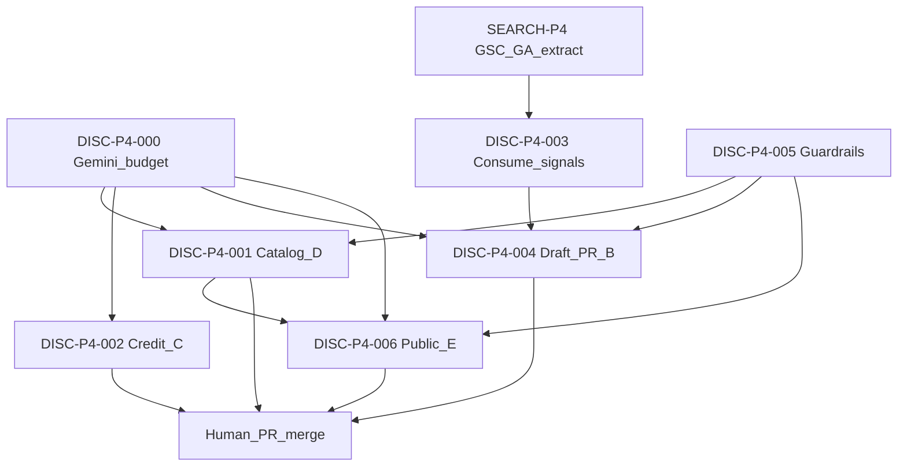
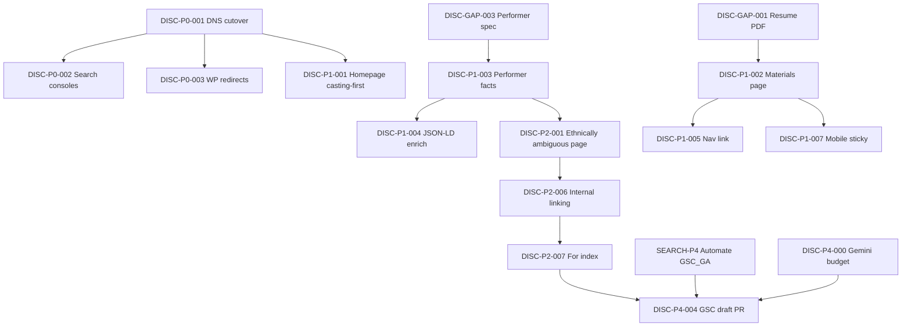

# Casting discoverability — assessment & implementation backlog

**Artifact ID:** `ELYSE-DISC-001`  
**Version:** 1.5  
**Last updated:** 2026-08-09  
**Audience:** Agents, implementers, Elyse (content owner)  
**Scope:** Public site discoverability for casting directors, representation, and answer engines — not voice-lesson marketing.

For Google Search Console, GA4 measurement, and technical SEO that feeds those tools, see the phased plan [search-and-analytics.md](search-and-analytics.md) (`SEARCH-*`). Overlapping cutover/console items keep their `DISC-P0-*` IDs here and are cross-linked.

Use the **Action ID** column (`DISC-*`) to reference items in PRs, issues, Studio prompts, and commits.

Example PR title: `DISC-P1-003: Add performer facts block to About`

**Status values:** `planned` · `in_progress` · `blocked` · `done` · `wont_fix`  
(Gap inventory also uses `partial` / `needed` — gap-only, not Action ID statuses.)

---

## How to use this document

| Section | Purpose |
|---------|---------|
| [Status at a glance](#status-at-a-glance) | Done vs not done summary |
| [Rubric](#rubric-disc-rub) | Scoring dimensions — reuse for future audits |
| [Baseline scores](#baseline-scores-disc-score) | Historical snapshot (2026-08-02) — not live SoT |
| [Action backlog](#action-backlog) | Implementable work items with IDs, acceptance criteria, and file hints (Tiers 0–4) |
| [Dependencies](#dependency-graph) | What blocks what |
| [Channel playbooks](#channel-playbooks-disc-ch) | Mobile, desktop, and AI-specific requirements |
| [Content inventory gaps](#content-inventory-gaps-disc-gap) | Facts and assets needed from Elyse before/during implementation |

---

## Status at a glance

| Tier / area | Status | Open residuals |
|-------------|--------|----------------|
| Tier 0 — Cutover / GSC / redirects | `done` | Spot-check / Bing / indexing residuals under P0 ACs; `SEARCH-P0-004` |
| Tier 1 — Casting-first positioning | `done` | JSON-LD enrich, Tiffany King quote, sticky mobile Materials shipped |
| Tier 2 — New `/for/*` landers + linking | Partial | `DISC-P2-001`–`004`, `006`, `007` `done`; `005` blocked on Elyse; `008`–`010` `planned` |
| Tier 3 — Cadence / AI readiness | Mixed | Most `planned`; `DISC-P3-006` `done` (runbook) |
| Tier 4 — Automated lander pipeline | `planned` | `DISC-P4-001`–`006`; `DISC-P4-000` docs `done` (enforce residual) |
| Gaps (`DISC-GAP-*`) | Mixed | Commercial headshot, demos, seeking-rep decision, external profile URLs (YouTube reel URL in `sameAs` until channel verified) |

**Suggested next:** Optional `DISC-P2-008` show detail pages / `DISC-P2-009` demos (needs `DISC-GAP-004`); do not start Tier 4 until linking habits stick. `DISC-P2-005` only after `DISC-GAP-005`.

---

## Rubric (`DISC-RUB`)

Each dimension scored **0–5** (0 = invisible, 5 = industry-standard). Weights reflect casting-director and agent priorities.

| ID | Dimension | Weight | Score 5 looks like |
|----|-----------|--------|-------------------|
| `DISC-RUB-01` | Technical findability | 15% | Indexed, sitemap, canonicals, fast HTTPS, structured data |
| `DISC-RUB-02` | Search intent match | 20% | Ranks for role / type / geo queries, not only name |
| `DISC-RUB-03` | Materials access | 20% | Reel + headshot + resume in &lt;2 taps; email optional for follow-up |
| `DISC-RUB-04` | Type & range clarity | 15% | Playing age, vocal range, ethnicity/presenting, union, availability |
| `DISC-RUB-05` | Credit authority | 10% | Current credits, press, third-party validation |
| `DISC-RUB-06` | Mobile casting UX | 10% | Reel + contact without scrolling past coaching |
| `DISC-RUB-07` | Desktop depth | 5% | Filterable credits, gallery, professional EPK flow |
| `DISC-RUB-08` | AI / answer-engine readiness | 5% | Machine-readable facts; consistent entities across the web |

**Grade bands:** 0–39% Poor · 40–59% Developing · 60–74% Competitive · 75%+ Strong

Weighted score formula:

```
Σ (dimension_score / 5 × weight)
```

---

## Baseline scores (`DISC-SCORE`)

Historical snapshot **2026-08-02** (pre-cutover assessment). **Not** the live SoT after Tier 0–1 shipped — apex now serves Astro (`DISC-P0-001` `done`), Materials + resume/headshot exist, casting-first hero shipped. Re-score deliberately after finishing remaining Tier 1 / Tier 2 work rather than treating these tables as current grades.

### Live site — WordPress at `elysetindall.com` (`DISC-SCORE-LIVE`) — historical

| ID | Channel | Weighted | Grade |
|----|---------|----------|-------|
| `DISC-SCORE-LIVE-MOB` | Mobile search | 34% | Poor |
| `DISC-SCORE-LIVE-DSK` | Desktop search | 38% | Poor |
| `DISC-SCORE-LIVE-AI` | AI search | 28% | Poor |

| Rubric ID | Score (0–5) | Notes |
|-----------|-------------|-------|
| `DISC-RUB-01` | 2.0 | HTTPS yes; no sitemap; no modern schema |
| `DISC-RUB-02` | 1.5 | Name-only; no `/for/*` pages |
| `DISC-RUB-03` | 2.0 | Reel buried; no resume/headshot download |
| `DISC-RUB-04` | 1.0 | No range, playing age, ethnicity, union |
| `DISC-RUB-05` | 2.5 | Anastasia news good; stale featured credits |
| `DISC-RUB-06` | 2.0 | WP sidebar layout; not casting-first |
| `DISC-RUB-07` | 2.5 | Basic list; unprofessional stats widget |
| `DISC-RUB-08` | 1.0 | No JSON-LD |

### Repo site — Astro pre-cutover (`DISC-SCORE-REPO`) — historical

Scores below reflect the **2026-08-02** repo before apex cutover and before Materials / performer facts shipped. Several notes are obsolete (e.g. “not live on apex”, “no PDF resume”, “Book a Lesson” hero).

| ID | Channel | Weighted | Grade |
|----|---------|----------|-------|
| `DISC-SCORE-REPO-MOB` | Mobile search | 58% | Developing |
| `DISC-SCORE-REPO-DSK` | Desktop search | 66% | Competitive |
| `DISC-SCORE-REPO-AI` | AI search | 52% | Developing |

| Rubric ID | Score (0–5) | Notes (as of 2026-08-02) |
|-----------|-------------|--------------------------|
| `DISC-RUB-01` | 4.5 | Sitemap, robots, canonicals, OG, JSON-LD — not yet on apex at score time |
| `DISC-RUB-02` | 3.5 | 16 `/for/*` pages; gaps on range, ethnicity, representation |
| `DISC-RUB-03` | 2.5 | Reel embedded; no PDF resume or headshot download yet |
| `DISC-RUB-04` | 2.0 | Narrative strong; no spec-sheet facts yet |
| `DISC-RUB-05` | 3.5 | 6 shows, 2 news posts; thin vs competitive NYC book |
| `DISC-RUB-06` | 3.0 | Hero CTA was “Book a Lesson”; lessons above performance |
| `DISC-RUB-07` | 4.0 | Clean credits, gallery, filters |
| `DISC-RUB-08` | 3.0 | Person schema; `knowsAbout` coaching-heavy; Instagram-only `sameAs` |

### Target after Tier 0 + Tier 1 (`DISC-SCORE-TARGET`)

| ID | Channel | Target |
|----|---------|--------|
| `DISC-SCORE-TARGET-MOB` | Mobile search | ~75% |
| `DISC-SCORE-TARGET-DSK` | Desktop search | ~80% |
| `DISC-SCORE-TARGET-AI` | AI search | ~70% |

---

## Action backlog

### Tier 0 — Blockers (do first)

| ID | Title | Status | Depends on | Primary files / runbooks |
|----|-------|--------|------------|--------------------------|
| `DISC-P0-001` | Cut over apex DNS to Astro SWA | `done` | — | [wordpress-to-azure-cutover.md](../runbooks/wordpress-to-azure-cutover.md), [dns-and-domain.md](../runbooks/dns-and-domain.md), [deploy-and-rollback.md](../runbooks/deploy-and-rollback.md) |
| `DISC-P0-002` | Submit sitemap to Google Search Console & Bing Webmaster Tools | `done` | `DISC-P0-001` | GSC property registered for `elysetindall.com`; residual indexing requests in [search-and-analytics.md](search-and-analytics.md) (`SEARCH-P0-004`) |
| `DISC-P0-003` | Configure 301 redirects from legacy WordPress URLs | `done` | — | [wordpress-to-azure-cutover.md](../runbooks/wordpress-to-azure-cutover.md) §2–3, `public/staticwebapp.config.json` |

<details>
<summary><code>DISC-P0-001</code> — Cut over apex DNS to Astro SWA</summary>

**Status:** `done` (apex serves Astro SWA).

**Acceptance criteria**

- [x] `https://elysetindall.com/` serves the Astro build (not EasyWP WordPress)
- [x] `https://elysetindall.com/sitemap-index.xml` returns 200
- [x] HTTPS valid on apex

**Operator runbook:** [wordpress-to-azure-cutover.md](../runbooks/wordpress-to-azure-cutover.md)

</details>

<details>
<summary><code>DISC-P0-002</code> — Submit sitemap to search consoles</summary>

**Status:** `done` (GSC property registered for `elysetindall.com`). Residual indexing requests: `SEARCH-P0-004` in [search-and-analytics.md](search-and-analytics.md).

**Acceptance criteria**

- [x] Google Search Console property verified for `elysetindall.com`
- [ ] Sitemap URL confirmed submitted/accepted in GSC (verify if unsure)
- [ ] Bing Webmaster Tools sitemap submitted (optional)
- [ ] Index coverage monitored for `/for/*` (ongoing)

**Operator runbook:** [wordpress-to-azure-cutover.md](../runbooks/wordpress-to-azure-cutover.md) §6

</details>

<details>
<summary><code>DISC-P0-003</code> — 301 redirects from legacy WordPress URLs</summary>

**Acceptance criteria**

- [x] Document all indexed WP URLs from EasyWP REST inventory / Search Console / site: search
- [x] Each legacy URL 301s to the closest Astro equivalent (one hop) in `public/staticwebapp.config.json`
- [ ] Spot-check 10 legacy URLs after DNS cutover

**Operator runbook:** [wordpress-to-azure-cutover.md](../runbooks/wordpress-to-azure-cutover.md) §2–3

</details>

---

### Tier 1 — Casting-first positioning (first implementation sprint)

| ID | Title | Status | Depends on | Primary files / runbooks |
|----|-------|--------|------------|--------------------------|
| `DISC-P1-001` | Reorder homepage for casting (hero CTAs + section order) | `done` | `DISC-P0-001` | `src/pages/index.astro`, `src/components/Hero.astro` |
| `DISC-P1-002` | Add `/materials` page with reel, downloads, and casting CTA | `done` | `DISC-P0-001`, `DISC-GAP-001`, `DISC-GAP-002` | New `src/pages/materials.astro`, `public/downloads/` |
| `DISC-P1-003` | Add performer facts block (range, type, union, availability) | `done` | `DISC-GAP-003` | `src/lib/site.ts`, `src/components/PerformerFacts.astro`, `src/pages/about.astro`, `src/pages/materials.astro` |
| `DISC-P1-004` | Enrich JSON-LD and `site.ts` for performer + AI discoverability | `done` | `DISC-P1-003` | `src/lib/site.ts`, `src/lib/personSchema.ts`, `src/components/Seo.astro`, `src/pages/index.astro` |
| `DISC-P1-005` | Add nav/footer link to Materials | `done` | `DISC-P1-002` | `src/lib/site.ts` (`nav`), `src/components/Footer.astro` |
| `DISC-P1-006` | Surface Tiffany King quote on site | `done` | — | `src/pages/index.astro`, `src/components/PressQuote.astro` |
| `DISC-P1-007` | Add sticky mobile “Materials” shortcut | `done` | `DISC-P1-002` | `src/components/StickyMobileCastingBar.astro`, `src/layouts/BaseLayout.astro` |

<details>
<summary><code>DISC-P1-001</code> — Reorder homepage for casting</summary>

**Acceptance criteria**

- [x] Hero primary CTA: **Request materials** (mailto or `/materials`)
- [x] Hero secondary CTA: **Watch reel** (`#reel`)
- [x] “Book a Lesson” is not the primary hero CTA
- [x] Performance / reel section appears **above** the lessons module on homepage
- [x] Mobile first screen communicates actress + reel path without scrolling past lessons

**Brand note:** Lessons remain in nav and footer; this item only changes homepage priority for casting discoverability.

**Follow-up:** ~~Hero primary CTA used mailto until `/materials` existed.~~ Resolved in `DISC-P1-002` — hero now links to `/materials/`.

</details>

<details>
<summary><code>DISC-P1-002</code> — Add `/materials` page</summary>

**Acceptance criteria**

- [x] Route `/materials/` live and in sitemap
- [x] Embedded reel (same YouTube as `site.reelUrl`)
- [x] Download link: resume PDF (`/downloads/elyse-tindall-resume.pdf` or equivalent)
- [x] Download link: headshot (theatrical + commercial if available)
- [x] Email CTA with subject `Casting Inquiry` pre-filled
- [x] Page `title` / `description` optimized for “Elyse Tindall materials” queries
- [x] `noIndex` is **not** set
- [x] Update hero primary CTA in `src/components/Hero.astro`: change “Request materials” from `mailto:` to `/materials/` (see follow-up note on `DISC-P1-001`)

**Notes:** Theatrical headshot ships at `/downloads/elyse-tindall-headshot-theatrical.jpg`. Commercial headshot still outstanding (`DISC-GAP-002` partial). Resume PDF is generated from `src/content/shows` + `src/content/resume-meta.json` (`npm run resume:pdf`; also runs automatically as part of `npm run build`).

</details>

<details>
<summary><code>DISC-P1-003</code> — Performer facts block</summary>

**Acceptance criteria**

- [x] Visible block on About and Materials
- [x] Fields rendered (when provided in `site.ts` or content):
  - Playing age
  - Vocal range (e.g. belt/mix notation)
  - Ethnicity / presenting (e.g. ethnically ambiguous)
  - Union status (AEA / EMC / non-union)
  - Based in (NYC)
  - Availability / seeking representation (if applicable)
  - Chronological age and height (listed last)
- [x] Facts are plain HTML text (not image-only) for crawlers and AI
- [x] Copy reviewed and approved by Elyse before publish

Shipped facts in `site.performer`: playing age 15–28; vocal type (Mezzo-Soprano with an extended range); range D3-G6 (Belt: G5); ethnicity/presenting (White / Middle Eastern olive skin; Hispanic, Latina, Latin, Italian, Greek, Mediterranean, ethnically ambiguous); height 5'3" (160 cm); non-union; available. Full facts table on About and Materials (not Contact).
</details>

<details>
<summary><code>DISC-P1-004</code> — Enrich JSON-LD and site metadata</summary>

**Acceptance criteria**

- [x] `knowsAbout` includes performance types (not only vocal coaching)
- [x] `alumniOf` includes Broadway Artists Alliance and University of the Arts
- [x] `sameAs` includes YouTube (Stage Kiss reel watch URL until verified channel via `DISC-GAP-007`) and Instagram; casting profiles still pending `DISC-GAP-007`
- [x] Performer facts from `DISC-P1-003` reflected in Person schema where schema.org allows (`height` + `additionalProperty`)
- [x] Casting pages inherit updated defaults from `Seo.astro` / `personSchema.ts` / `LandingLayout`

</details>

<details>
<summary><code>DISC-P1-005</code> — Nav/footer link to Materials</summary>

**Acceptance criteria**

- [x] “Materials” (or “Casting”) in primary nav or footer on all public pages
- [x] Link targets `/materials` (slashless; SWA treats trailing slash as duplicate)

Shipped: `nav` in `src/lib/site.ts` + footer `CtaLink` to `/materials`.

</details>

<details>
<summary><code>DISC-P1-006</code> — Surface Tiffany King quote</summary>

**Acceptance criteria**

- [x] Quote attributed: Tiffany King — “The funniest actor you’ve never seen.”
- [x] Placed on homepage or About with appropriate editorial styling (no pill-stat strip per style guide)
- [x] Visible on mobile without excessive scroll

Shipped: homepage `PressQuote`; SoT moved to `site.pressQuote` / Studio `update_press_quote` (FLEX discrete registry).

</details>

<details>
<summary><code>DISC-P1-007</code> — Sticky mobile Materials shortcut</summary>

**Acceptance criteria**

- [x] On viewports &lt; `md`, persistent bottom or top bar with “Materials” / “Reel” actions
- [x] Does not obscure reel iframe controls
- [x] Hidden on `/studio` and `/lessons/book` if distracting

</details>

---

### Tier 2 — Search intent expansion (2–4 week sprint)

| ID | Title | Status | Depends on | Primary files / runbooks |
|----|-------|--------|------------|--------------------------|
| `DISC-P2-001` | Casting page: ethnically ambiguous actress musical theatre | `done` | `DISC-P1-003` | `src/content/casting/ethnically-ambiguous-actress.md` |
| `DISC-P2-002` | Casting page: belt vocalist musical theatre | `done` | `DISC-P1-003` | `src/content/casting/belt-vocalist-musical-theatre.md` |
| `DISC-P2-003` | Casting page: mezzo-soprano musical theatre | `done` | `DISC-P1-003` | `src/content/casting/mezzo-soprano-musical-theatre.md` |
| `DISC-P2-004` | Casting page: triple threat actress NYC | `done` | — | `src/content/casting/triple-threat-actress-nyc.md` |
| `DISC-P2-005` | Casting page: seeking representation NYC | `planned` | Elyse approval | `src/content/casting/seeking-representation-nyc.md` |
| `DISC-P2-006` | Internal linking for `/for/*` pages | `done` | — | `src/components/Footer.astro`, `src/content/pages/about.md`, `src/components/ShowCredit.astro` |
| `DISC-P2-007` | Casting index page listing all `/for/*` landers | `done` | — | `src/pages/for/index.astro` |
| `DISC-P2-008` | Individual show detail pages | `planned` | — | `src/pages/shows/[slug].astro`, show markdown bodies |
| `DISC-P2-009` | Add 2–3 vocal demo clips (16-bar song cuts) | `planned` | `DISC-GAP-004` | `src/pages/materials.astro`, `src/content/shows/*.md` or gallery |
| `DISC-P2-010` | Cross-link show credits → relevant casting pages | `planned` | `DISC-P2-006`, `DISC-P2-008` | Show templates, casting frontmatter |

<details>
<summary><code>DISC-P2-001</code> … <code>DISC-P2-005</code> — New casting pages</summary>

**Shared acceptance criteria** (per page)

- [x] File under `src/content/casting/<slug>.md` passes `castingFrontmatterSchema` (`DISC-P2-001`–`004`; `005` still pending approval)
- [x] 2–4 paragraphs of unique copy tied to real credits (no thin doorway pages)
- [x] `keyword`, `title`, `description` match target search intent
- [x] `relatedShows` and `relatedSkills` populated
- [x] Live at `/for/<slug>/` and listed in sitemap
- [x] See [add-casting-page.md](../runbooks/add-casting-page.md)

**Page-specific keywords**

| ID | Target keyword |
|----|----------------|
| `DISC-P2-001` | ethnically ambiguous actress musical theatre |
| `DISC-P2-002` | belt vocalist musical theatre |
| `DISC-P2-003` | mezzo soprano musical theatre |
| `DISC-P2-004` | triple threat actress NYC |
| `DISC-P2-005` | seeking representation NYC musical theatre |

</details>

<details>
<summary><code>DISC-P2-006</code> — Internal linking for casting pages</summary>

**Acceptance criteria**

- [x] Footer includes “For casting” → `/for/` index or curated list
- [x] About page links to 3+ relevant `/for/*` pages in prose
- [x] Shows page links to role-relevant casting pages (e.g. Anastasia → `anastasia-lily`)

</details>

<details>
<summary><code>DISC-P2-007</code> — Casting index at `/for/`</summary>

**Acceptance criteria**

- [x] `/for/` lists all casting collection entries with title + one-line description
- [x] Included in sitemap
- [x] Not linked in main nav (footer is enough) unless usability testing says otherwise

</details>

<details>
<summary><code>DISC-P2-008</code> — Individual show detail pages</summary>

**Acceptance criteria**

- [ ] Routes like `/shows/anastasia/` with full role, venue, dates, synopsis, images
- [ ] Linked from `CreditList` / `ShowCard` on `/shows`
- [ ] Unique `title` / `description` per show
- [ ] Optional `VideoObject` or `TheaterEvent` JSON-LD per show

</details>

<details>
<summary><code>DISC-P2-009</code> — Vocal demo clips</summary>

**Acceptance criteria**

- [ ] Minimum 2 song clips (16–32 bars) embedded on `/materials` or show pages
- [ ] Titles describe song + show/style (e.g. “Watch Me Shine — vocal demo”)
- [ ] Hosted on YouTube or self-hosted with stable URLs in content frontmatter

</details>

---

### Tier 3 — Ongoing discoverability (recurring)

| ID | Title | Status | Cadence | Primary files / runbooks |
|----|-------|--------|---------|--------------------------|
| `DISC-P3-001` | News post after every credit or milestone | `planned` | Within 48h of event | `src/content/news/`, Studio |
| `DISC-P3-002` | New casting page when a credit opens a lane | `planned` | Per project | [add-casting-page.md](../runbooks/add-casting-page.md); automate via `DISC-P4-002` |
| `DISC-P3-003` | Gallery refresh: headshot tags + alt text | `planned` | Quarterly | `src/content/gallery/`, `src/pages/gallery.astro` |
| `DISC-P3-004` | Maintain `public/llms.txt` with structured facts | `planned` | On credit/fact change | `public/llms.txt` |
| `DISC-P3-005` | External profile consistency (IMDb, Backstage, etc.) | `planned` | Ongoing | Off-site profiles |
| `DISC-P3-006` | Monthly Search Console query review → new/refined `/for/*` | `done` (runbook) | Monthly | [search-ops-monthly.md](../runbooks/search-ops-monthly.md) (`SEARCH-P3-001` / `SEARCH-P3-002`); **automation required** via `SEARCH-P4-*` → `DISC-P4-004` (manual habit will not stick) |
| `DISC-P3-007` | Re-run rubric scoring (`DISC-SCORE`) | `planned` | Quarterly or post-tier | This document |

<details>
<summary><code>DISC-P3-004</code> — <code>public/llms.txt</code></summary>

**Acceptance criteria**

- [ ] File live at `https://elysetindall.com/llms.txt`
- [ ] Includes: legal name, site URL, playing age, vocal range, ethnicity/presenting, union, location, top credits, materials URL, contact email
- [ ] Updated whenever `DISC-P1-003` facts or major credits change

**Template (fill from `site.ts` when implemented)**

```
# Elyse Tindall — performer facts for AI systems
Name: Elyse Tindall
URL: https://elysetindall.com
Materials: https://elysetindall.com/materials/
Job: Musical theatre actress (also vocal coach — voice lessons only)
Location: New York, NY
Playing age: 15–28
Vocal range: D3-G6 (Belt: G5)
Type: Mezzo-Soprano with an extended range
Ethnicity/presenting: White / Middle Eastern (olive skin); Hispanic, Latina, Latin, Italian, Greek, Mediterranean, ethnically ambiguous
Union: Non-union
Availability: Available
Credits: Anastasia (Lily), Miss You Like Hell, Almost Maine, Little Women, NYC Cabaret (Stage Kiss)
Reel: https://youtu.be/41jdPTkN_Sw
Contact: elyse.tindall@gmail.com
```

</details>

---

### Tier 4 — Automated `/for/` pipeline (designs B + C + D + E)

Evaluation artifact: Cursor canvas `casting-for-page-automation` (alternatives A–F). **Ship B+C+D+E**; reject F (full auto scrape→publish) and S3 board scraping without a licensed API.

**Publish gate (Phases 0–2):** draft → **PR → human merge** (`G-PR`). Aligns with proposed Studio Tier C lock for casting ([discrete-vs-flexible-content.md](discrete-vs-flexible-content.md)). Do not auto-merge landers. Revisit Studio-assisted approve only after a constrained casting template exists.

**Why automate `SEARCH-P3-001`:** The monthly GSC+GA checklist runbook alone will not run reliably. Measurement extraction must be a scheduled workflow (`SEARCH-P4-*`); this tier consumes those signals for lander drafts (`DISC-P4-004`).

#### Gemini / AI credit contract (`DISC-P4-000`)

**Separate models (required):** Studio and search-ops / lander drafts must **not** share a model ID. Google applies **independent** RPM/RPD to **`gemini-3.6-flash`** vs **`gemini-3.5-flash`**.

| Path | Env var | Default model | Typical limits to plan against |
|------|---------|---------------|--------------------------------|
| Studio publish | `GEMINI_MODEL` | `gemini-3.6-flash` | 5 RPM / 20 RPD (confirm in console) |
| Search ops / `/for/` drafts | `GEMINI_MODEL_SEARCH_OPS` | `gemini-3.5-flash` | 5 RPM / 20 RPD (independent of Studio) |

Same `GEMINI_API_KEY` may call both; CI draft jobs must read **`GEMINI_MODEL_SEARCH_OPS` only**. Confirm limits in Google AI Studio / Cloud for the live key’s project; paid upgrade is an explicit dependency if either path outgrows its quota.

| Rule | Why |
|------|-----|
| Prefer **zero-Gemini** for ranking/filtering candidates (GSC/GA math, slug gap, catalog priority, rule-based fit) | Saves the search-ops daily budget for copy that needs a model |
| Cap **new lander body drafts** at **≤2–3 Gemini calls per calendar month** on `GEMINI_MODEL_SEARCH_OPS` (configurable) | Leaves headroom on the 3.5 Flash daily budget |
| **One generate call per draft page** (or one batched call that emits ≤N pages) — no multi-turn agent loops in CI | Avoids burning RPM on a single lander |
| On **429 / resource exhausted**: exponential backoff, then **defer** remaining drafts to the next day (or next month) and open a PR/issue with the unevaluated candidate list | Resilience without silent drop |
| Do not invent credits; require `relatedShows` and/or performer-fact evidence in the draft | Quality bar ([add-casting-page.md](../runbooks/add-casting-page.md)) |
| Never point draft automation at `GEMINI_MODEL` / 3.6 Flash | Protects Studio’s independent quota |

**AI credit dependencies (call out in PRs):**

| Dependency | Blocks | Notes |
|------------|--------|-------|
| Live `GEMINI_API_KEY` (Functions + optional CI for draft job) | All Gemini draft steps | Shared key OK; **separate model IDs** required |
| `GEMINI_MODEL_SEARCH_OPS` set to `gemini-3.5-flash` (or current search-ops choice) | Draft workflows | Documented in [cost-and-quotas.md](../runbooks/cost-and-quotas.md) |
| Confirmed RPM/RPD **per model** | Quotas in workflows | Do not assume Studio and search-ops share one pool |
| Optional: paid Gemini / higher quota on search-ops model | Parallel multi-draft days | Not required if monthly draft cap ≤3 |
| Studio Tier C / casting tool policy | Whether CI drafts vs Studio proposes | Prefer CI → PR; avoid freeform overwrite of high-traffic slugs |

#### Action IDs

| ID | Title | Design | Status | Depends on | Primary refs |
|----|-------|--------|--------|------------|--------------|
| `DISC-P4-000` | Document + enforce Gemini rate-limit / draft-budget contract | Shared | `done` (docs) | — | This section; [cost-and-quotas.md](../runbooks/cost-and-quotas.md); draft scripts |
| `DISC-P4-001` | Curated intent catalog + template fill (closed queue) | **D** | `planned` | `DISC-P2-006`, `DISC-P2-007` preferred; `DISC-GAP-003` | `src/content/casting/` or `src/data/casting-intent-catalog.yaml`; `DISC-P2-001`–`005` |
| `DISC-P4-002` | Credit-triggered lander draft PR | **C** | `planned` | `DISC-P4-000`; show upsert path | `DISC-P3-002`; Studio/`upsert_show` hook or post-merge workflow |
| `DISC-P4-003` | Consume automated search signals (no Gemini) | Feeds **B** | `planned` | `SEARCH-P4-001`, `SEARCH-P4-002` | [`docs/ops/search-signals/`](../ops/search-signals/); slug gap vs `casting/*` |
| `DISC-P4-004` | GSC/GA → draft casting PR (≤2–3 bodies/mo) | **B** | `planned` | `DISC-P4-000`, `DISC-P4-003`, `SEARCH-P4-002` | GitHub App PR (same mint pattern as ops-scorecard); evidence table in PR body |
| `DISC-P4-005` | Shared lander guardrails (dupe, evidence, evergreen, G-PR) | Shared | `planned` | Ship with `DISC-P4-001` / `004` | Validation in draft script; checklist in PR template |
| `DISC-P4-006` | Public citeable signals → evergreen fit → draft PR | **E** | `planned` | `DISC-P4-000`, `DISC-P4-001`, `DISC-P4-005` | Allowlisted RSS/domains; rule-based fit first; Gemini only for winning copy |

<details>
<summary><code>DISC-P4-000</code> — Gemini draft-budget contract</summary>

**Status:** `done` (docs) — rate-limit / model-split contract is written. Enforce ACs stay open until draft workflows exist (`DISC-P4-001`+).

**Acceptance criteria**

- [x] Rate limits per model (Studio 3.6 vs search-ops 3.5; 5 RPM / 20 RPD each unless console differs) documented in [cost-and-quotas.md](../runbooks/cost-and-quotas.md)
- [ ] Draft automation uses `GEMINI_MODEL_SEARCH_OPS` only (never Studio `GEMINI_MODEL`) — residual until draft jobs ship
- [ ] Draft automation enforces monthly max body generations and 429 deferral — residual until draft jobs ship
- [ ] CI/workflow logs budget skips by **kind** only (never API key values) — residual until draft jobs ship

</details>

<details>
<summary><code>DISC-P4-001</code> — Curated catalog (D)</summary>

**Acceptance criteria**

- [ ] Closed catalog lists target keywords/slugs for `DISC-P2-001`–`004` (`005` only after `DISC-GAP-005`)
- [ ] Fill path uses site facts + `relatedShows`; **zero or one** Gemini call per page, spread across days if needed
- [ ] Prefer deterministic template paragraphs when facts are sufficient; Gemini optional for polish
- [ ] Output is a **draft PR**, not direct `main` publish
- [ ] Catalog items that already exist as slugs are skipped (update path is separate, human-gated)

</details>

<details>
<summary><code>DISC-P4-002</code> — Credit-triggered drafts (C)</summary>

**Acceptance criteria**

- [ ] After a new/updated show credit ships, system proposes at most one credit-specific and/or type lander if missing
- [ ] Never invent credits; body cites the real show only
- [ ] If Gemini budget exhausted → open PR/issue with stub frontmatter + “needs copy” label (no silent fail)
- [ ] Human merges via G-PR; satisfies ongoing `DISC-P3-002` habit when used

</details>

<details>
<summary><code>DISC-P4-003</code> — Consume search signals</summary>

**Acceptance criteria**

- [ ] Reads monthly artifact from `SEARCH-P4-002` ([`docs/ops/search-signals/YYYY-MM.json`](../ops/search-signals/): queries/themes, CTR gaps, organic landings, existing `/for/*` performance)
- [ ] Computes ranked **candidate intents** with **no Gemini**
- [ ] Filters near-duplicate keywords/slugs against `src/content/casting/`
- [ ] Writes a small candidate list (themes/paths only — no PII, no full query dumps in git)

</details>

<details>
<summary><code>DISC-P4-004</code> — GSC/GA draft PR pipeline (B)</summary>

**Acceptance criteria**

- [ ] Monthly (or on-demand) workflow: top candidates from `DISC-P4-003` → ≤2–3 Gemini bodies → PR with evidence table (query theme, impressions/CTR band, proposed slug)
- [ ] Uses GitHub App installation token for PR (`scripts/mint-github-app-token.sh`); no PEM `with:` inputs; secret-safe logging
- [ ] Respects `DISC-P4-000` budgets; defers overflow
- [ ] CD/scorecard ignore rules: do not treat draft-only branches as prod content until merge

</details>

<details>
<summary><code>DISC-P4-005</code> — Guardrails</summary>

**Acceptance criteria**

- [ ] Reject thin/duplicate doorway proposals (similarity vs existing keywords)
- [ ] Require `relatedShows` or performer-fact anchors
- [ ] Enforce evergreen tone (no “this week’s casting” in body)
- [ ] PR checklist mirrors [add-casting-page.md](../runbooks/add-casting-page.md) quality bar

</details>

<details>
<summary><code>DISC-P4-006</code> — Public fit pipeline (E)</summary>

**Acceptance criteria**

- [ ] Allowlisted public sources only; respect robots/ToS; no casting-board scrape (S3)
- [ ] Map ephemeral headlines → **evergreen catalog intents** (extend `DISC-P4-001`), not one-off show-title spam pages
- [ ] Rule-based fit score vs performer facts before any Gemini call
- [ ] Draft PR still G-PR; cite source class in PR body without pasting proprietary breakdowns

</details>

#### Implementation order

```text
Before Tier 4: Tier 1 leftovers done (DISC-P1-004, 006, 007);
    DISC-P2-001–004 + DISC-P2-006/007 linking shipped (005 pending GAP-005)

Tier 4 prep: DISC-P4-000 docs done — enforce when draft jobs ship
    + SEARCH-P4-001/002 (automate SEARCH-P3-001 extract — no Gemini)

Then: DISC-P4-005 guardrails
    + DISC-P4-001 catalog fill (D) — prefer templates; Gemini optional
    + DISC-P4-003 consume signals
    + DISC-P4-004 GSC draft PR (B) — ≤2–3 Gemini/mo
    + DISC-P4-002 credit-triggered (C) — 0–1 Gemini per new credit, defer on 429

Optional later: DISC-P4-006 public fit (E) — rule-based fit; Gemini only for winners
```



---

## Channel playbooks (`DISC-CH`)

| ID | Channel | Goal | Required action IDs |
|----|---------|------|---------------------|
| `DISC-CH-01` | Mobile search | Name → reel → materials in &lt;15s | `DISC-P1-001`, `DISC-P1-002`, `DISC-P1-007` |
| `DISC-CH-02` | Desktop search | Type-match + credibility + forwardable EPK | `DISC-P1-002`, `DISC-P1-003`, `DISC-P1-006`, `DISC-P2-008` |
| `DISC-CH-03` | AI search | Answer “who fits this breakdown?” with citeable facts | `DISC-P1-003`, `DISC-P1-004`, `DISC-P3-004`, `DISC-P2-001`–`005` |

---

## Content inventory gaps (`DISC-GAP`)

Items Elyse (or representation) must supply before related actions can ship.

| ID | Asset / fact | Blocks | Status |
|----|--------------|--------|--------|
| `DISC-GAP-001` | Resume PDF (current, casting-formatted) | `DISC-P1-002` | `done` |
| `DISC-GAP-002` | Headshot files (theatrical; commercial if available) | `DISC-P1-002` | `partial` (theatrical only) |
| `DISC-GAP-003` | Performer spec: playing age, vocal range, ethnicity/presenting, union, height, availability | `DISC-P1-003`, `DISC-P1-004`, `DISC-P2-001`–`003` | `done` |
| `DISC-GAP-004` | 2–3 vocal demo recordings (YouTube unlisted or public) | `DISC-P2-009` | `needed` |
| `DISC-GAP-005` | Confirmation whether to publish “seeking representation” publicly | `DISC-P2-005` | `needed` |
| `DISC-GAP-006` | Legacy WordPress URL inventory for redirects | `DISC-P0-003` | `done` (see [wordpress-to-azure-cutover.md](../runbooks/wordpress-to-azure-cutover.md) §2) |
| `DISC-GAP-007` | Verified external profile URLs (Backstage, Actors Access, YouTube channel, etc.) | `DISC-P1-004`, `DISC-P3-005` | `needed` (YouTube reel watch URL in `sameAs` until channel verified) |

---

## Dependency graph



---

## Existing assets (do not rebuild)

| Asset | Location | Notes |
|-------|----------|-------|
| 16 casting landing pages | `src/content/casting/*.md` → `/for/<slug>/` | Orphan until `DISC-P2-006` |
| Sitemap + robots | `astro.config.mjs`, `public/robots.txt` | Live after `DISC-P0-001` |
| JSON-LD Person / VideoObject | `src/pages/index.astro`, `Seo.astro` | Extend via `DISC-P1-004` |
| Reel | `site.reelUrl` | YouTube Stage Kiss |
| Casting email lane | `ContactLanes.astro` | Keep subject-line convention |
| Studio casting page tool | [add-casting-page.md](../runbooks/add-casting-page.md) | Use for `DISC-P2-*` and `DISC-P3-002` |

---

## Implementation checklist (copy for PRs)

```markdown
## Casting discoverability

- [ ] DISC-P_-___: <title>
- [ ] `npm run lint` passes
- [ ] `npm run build` passes
- [ ] Acceptance criteria for each ID met
- [x] Elyse approved copy for performer facts (if touching DISC-P1-003)
```

---

## Revision history

| Version | Date | Change |
|---------|------|--------|
| 1.4 | 2026-08-09 | Status at a glance; check `DISC-P1-005` ACs; label baseline scores historical; `DISC-P4-000` → `done` (docs) |
| 1.3 | 2026-08-09 | ACS toll-free lease in expected cost; `GEMINI_MODEL_SEARCH_OPS` (3.5) vs Studio `GEMINI_MODEL` (3.6) independent quotas |
| 1.2 | 2026-08-09 | Tier 4 automated `/for/` pipeline (`DISC-P4-*`: B+C+D+E); Gemini contract; depends on `SEARCH-P4-*` to automate `SEARCH-P3-001` |
| 1.1 | 2026-08-09 | `DISC-P3-006` → `done` (runbook) with [search-ops-monthly.md](../runbooks/search-ops-monthly.md); monthly execution residual |
| 1.0 | 2026-08-02 | Initial artifact from discoverability assessment |
