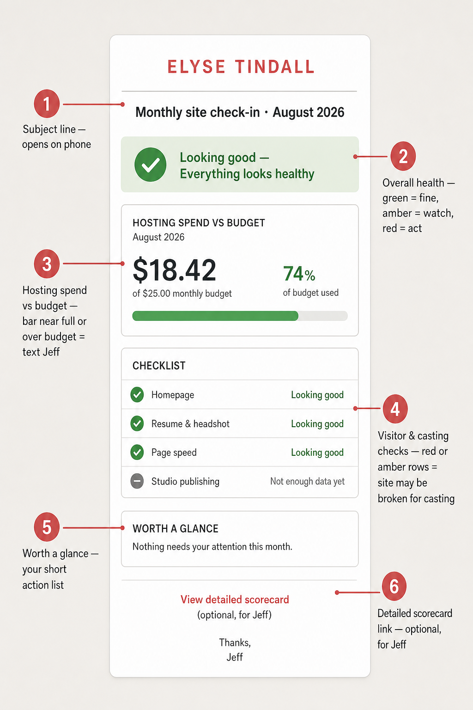

# Monthly site check-in email

A short guide for **Elyse** (and anyone else who receives the monthly email) on how to read it and what to do.

You do **not** need to understand Azure, GitHub, or the technical scorecard. Jeff handles that. Your job is a two-minute skim: is the site healthy for casting, and is hosting spend still sensible?

## What you get

Around the **1st of each month**, an email arrives with a subject like:

> **ElyseTindall.com monthly check-in · August 2026**

It summarizes:

1. Overall site health  
2. Last month’s hosting cost vs the budget  
3. Whether the homepage, resume/headshot links, page speed, and Studio behaved as expected  
4. A short “worth a glance” list — only if something needs you  

It never includes passwords, secret keys, or private phone numbers.

## Annotated reference

| # | Section | What it means | What to look for |
|---|---------|---------------|------------------|
| **1** | Subject line | Confirms this is the monthly check-in | Opens fine on your phone; month/year matches |
| **2** | Overall health banner | One-line verdict for the whole month | **Green** = fine · **Amber** = keep an eye on it · **Red** = act (text Jeff) |
| **3** | Hosting cost | What Azure charged last month vs the monthly budget (~$31) | Bar near full, or **Over budget** → message Jeff. Small dollar swings are normal. |
| **4** | For visitors & casting | Automated checks that matter for casting: home page, resume PDF, headshot, speed, Studio | **Looking good** = no action. **Needs attention** / **Keep an eye on it** = casting or Studio may be affected — tell Jeff. **Not enough data yet** = quiet month (often fine for Studio if you did not publish) |
| **5** | Worth a glance | Your short action list | If it says nothing needs attention, you are done. If it lists items, those are the only things to act on. |
| **6** | Detailed scorecard link | Full technical write-up | Optional — for Jeff. You can ignore it. |

Numbers and dollar amounts in the picture are **examples**. Your real email will show that month’s actual figures.

## How is this actionable?

The email is useful only if it changes what you do. Use this decision table:

| If you see… | Do this |
|-------------|---------|
| Green banner + “Nothing needs your attention” | **Nothing.** Archive the email. |
| Amber banner or amber rows (watch) | **Optional:** glance at the site on your phone (home, `/materials` or resume link). If something looks wrong, text Jeff. If it looks fine, wait for next month unless Jeff follows up. |
| Red banner or “Needs attention” on Homepage / Resume & headshot / Page speed | **Act the same day:** open [elysetindall.com](https://elysetindall.com) yourself. If you also see a problem, text Jeff with what page failed. If the site looks fine to you, still ping Jeff — the monitor may have caught something intermittent. |
| “Needs attention” on Studio publishing or Live after publish | **Only if you tried to publish** and it failed or stayed draft-looking. Retry once from Studio; if it still fails, send Jeff the **Reference:** code from the error screen. If you did not publish that month, you can ignore Studio rows that say “not enough data.” |
| Hosting **Over budget** or the bar looks full | **Message Jeff** (no need to dig into Azure). Ask whether spend is expected (new feature, traffic spike) or needs trimming. |
| Spend missing / “could not be checked” | **No action for you** — Jeff will fix the cost report. |

### What you should *not* do

- Do not chase the “detailed scorecard” link unless Jeff asks you to.  
- Do not change passwords, DNS, or Azure settings from this email.  
- Do not treat “Not enough data yet” as a failure — it usually means a quiet Studio month.  
- Separate from this email: **urgent** site-down or deploy alerts may still text/call Jeff’s ops channel. Those are emergencies; this monthly note is a calm summary.

## Quick phone checklist (only when amber/red)

1. Open the home page — does it load?  
2. Open your resume PDF / headshot from the materials path you share with casting — do they open?  
3. If you published recently from Studio — did the change show on the live site within about 20 minutes?  
4. Reply to Jeff with: page that failed + roughly when you checked + screenshot if easy.

## Who receives it?

The digest goes to the ops alert address and your site contact address (from Key Vault — never stored in the public repo). Same email body for both; Jeff uses it for ops, you use it for peace of mind and the rare “please look” nudge.

## Related

- [Cost and quotas](cost-and-quotas.md) — expected Azure spend and budget formula (technical)  
- Living technical scorecard: [`docs/ops/operational-excellence-scorecard.md`](../ops/operational-excellence-scorecard.md)  
- Preview the HTML locally (Jeff): `npm run ops:scorecard-email:preview`
